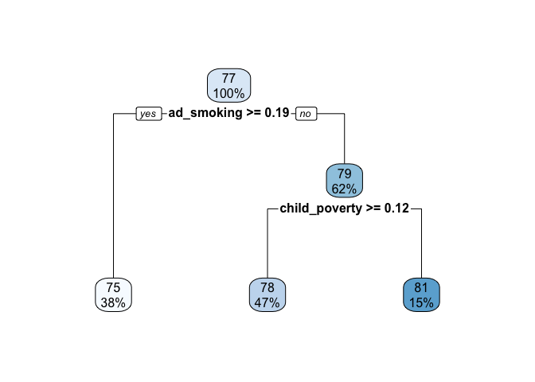

CaRT Demonstration
================
JAS/jck2183
null

## Demonstration of Classification and Regression Trees (CaRT) using R

This demonstration of classification and regression trees (CaRT) will
utilize the 2019 County Health Rankings. The rankings provide data on a
number of demographic, social and environmental health characteristics
for counties in the United States. We will be using this dataset to
address two research questions.

1.  What are the predictors of life expectacy on a county-level?

2.  Imagine a scenario where the maintainers of the CHR were concerned
    that the data on firearm fatalities would no longer be made public.
    This information has been use by a number of foundations to target
    population-based interventions at reducing gun violence. They are
    wondering if the counties with higher proportions of firearm
    fatalities would still be able to be identified, based on the other
    data within the CHR. That is, can the other data in the CHR be used
    to classify counties according to having higher or lower
    firearm\_fatalities?

The first question will be addressed with a regression tree, while the
second will be addressed with a classification tree.

-----

### Step 1: Load needed packages

We will be using two different packages: rpart and caret. Both of these
packages allow us to construct classification and regression trees, but
they have different levels of functionality. Also loading tidyverse for
some data wrangling and rpart.plot which makes cleaner looking plots of
the trees.

``` r
library(tidyverse)
```

    ## ── Attaching packages ─────────────────────────────────────── tidyverse 1.3.0 ──

    ## ✓ ggplot2 3.3.3     ✓ purrr   0.3.4
    ## ✓ tibble  3.0.6     ✓ dplyr   1.0.4
    ## ✓ tidyr   1.1.2     ✓ stringr 1.4.0
    ## ✓ readr   1.4.0     ✓ forcats 0.5.1

    ## ── Conflicts ────────────────────────────────────────── tidyverse_conflicts() ──
    ## x dplyr::filter() masks stats::filter()
    ## x dplyr::lag()    masks stats::lag()

``` r
library(rpart)
library(caret)
```

    ## Loading required package: lattice

    ## 
    ## Attaching package: 'caret'

    ## The following object is masked from 'package:purrr':
    ## 
    ##     lift

``` r
library(rpart.plot)
library(pROC)
```

    ## Type 'citation("pROC")' for a citation.

    ## 
    ## Attaching package: 'pROC'

    ## The following objects are masked from 'package:stats':
    ## 
    ##     cov, smooth, var

### Step 2: Load and check data

Variable names in the original dataset were not informative, so we need
to append our own as column names. We also need to strip off the Id
variable for easier processing. We’re also going to look at some basic
descriptives of the data to determine if it needs cleaning, imputation
of missing data, etc.

``` r
chr<-read.csv("./data/chr.csv")

chr<-chr[,2:68]

var.names<-c("pre_death", "poorhealth", "poorphyshealth_days", "poormenthealth_days", "low_bwt", "ad_smoking", "ad_obesity", "foodenv_index", "phys_inactivity", "exer_access", "excess_drink", "alc_drivdeaths", "sti", "teen_birth", "uninsured", "primcareproviders", "dentists", "menthealthproviders", "prevhosp", "mammo_screen", "flu_vacc", "hsgrad", "somecollege", "unemployed", "child_poverty", "income_ineq", "sing_parent", "social_assoc", "violent_crime", "injury_deaths", "pm_air", "water_viol", "housing_prob", "driving_alone", "long_commute", "life_exp", "age_adj_premortality", "freq_physdistress", "freq_mentdistress", "diabetes", "hiv", "food_insecure", "ltd_access_healthyfood", "mvcrash_deaths", "insuff_sleep", "uninsured_adults", "uninsured_child", "other_pcp", "medhhinc", "freelunch_child", "res_seg_bw", "res_seg_nw", "firearm_fatalities", "homeownership", "hous_cost_burden", "population", "bw18", "gte65", "nonhisp_afam", "AmerInd_AlasNative", "Asian", "OPacIslander", "Hisp", "nonhisp_white", "nonprof_english", "female", "rural")

colnames(chr)<-var.names

chr$age_adj_premortality<-NULL
chr$pre_death<-NULL

#Will idenitify any rows that do not have complete cases (i.e. have missing data)
miss.rows<-chr[!complete.cases(chr),]

summary(chr)
```

    ##    poorhealth      poorphyshealth_days poormenthealth_days    low_bwt       
    ##  Min.   :0.08289   Min.   :2.324       Min.   :2.440       Min.   :0.02646  
    ##  1st Qu.:0.13948   1st Qu.:3.393       1st Qu.:3.493       1st Qu.:0.06794  
    ##  Median :0.16687   Median :3.869       Median :3.932       Median :0.07877  
    ##  Mean   :0.17468   Mean   :3.920       Mean   :3.932       Mean   :0.08112  
    ##  3rd Qu.:0.20432   3rd Qu.:4.409       3rd Qu.:4.348       3rd Qu.:0.09029  
    ##  Max.   :0.40732   Max.   :7.231       Max.   :5.964       Max.   :0.26136  
    ##    ad_smoking        ad_obesity     foodenv_index    phys_inactivity 
    ##  Min.   :0.06735   Min.   :0.1360   Min.   : 0.000   Min.   :0.0840  
    ##  1st Qu.:0.15234   1st Qu.:0.2930   1st Qu.: 6.900   1st Qu.:0.2220  
    ##  Median :0.17316   Median :0.3230   Median : 7.700   Median :0.2560  
    ##  Mean   :0.17867   Mean   :0.3203   Mean   : 7.465   Mean   :0.2564  
    ##  3rd Qu.:0.20275   3rd Qu.:0.3500   3rd Qu.: 8.200   3rd Qu.:0.2910  
    ##  Max.   :0.42754   Max.   :0.4950   Max.   :10.000   Max.   :0.4510  
    ##   exer_access      excess_drink     alc_drivdeaths        sti        
    ##  Min.   :0.0000   Min.   :0.09265   Min.   :0.0000   Min.   :  40.1  
    ##  1st Qu.:0.4928   1st Qu.:0.15102   1st Qu.:0.2033   1st Qu.: 224.0  
    ##  Median :0.6671   Median :0.17403   Median :0.2857   Median : 336.8  
    ##  Mean   :0.6319   Mean   :0.17431   Mean   :0.2927   Mean   : 385.2  
    ##  3rd Qu.:0.8028   3rd Qu.:0.19678   3rd Qu.:0.3600   3rd Qu.: 469.2  
    ##  Max.   :1.0000   Max.   :0.29440   Max.   :1.0000   Max.   :3543.9  
    ##    teen_birth        uninsured       primcareproviders      dentists        
    ##  Min.   :  2.395   Min.   :0.02068   Min.   :0.0000000   Min.   :0.0000000  
    ##  1st Qu.: 21.339   1st Qu.:0.07156   1st Qu.:0.0003311   1st Qu.:0.0002661  
    ##  Median : 31.432   Median :0.10364   Median :0.0005104   Median :0.0004211  
    ##  Mean   : 31.983   Mean   :0.11108   Mean   :0.0005494   Mean   :0.0004571  
    ##  3rd Qu.: 40.934   3rd Qu.:0.13987   3rd Qu.:0.0007067   3rd Qu.:0.0006041  
    ##  Max.   :110.236   Max.   :0.33454   Max.   :0.0047722   Max.   :0.0072513  
    ##  menthealthproviders    prevhosp      mammo_screen       flu_vacc     
    ##  Min.   :0.0000000   Min.   :  471   Min.   :0.0700   Min.   :0.0300  
    ##  1st Qu.:0.0004945   1st Qu.: 3680   1st Qu.:0.3500   1st Qu.:0.3500  
    ##  Median :0.0011861   Median : 4668   Median :0.4000   Median :0.4200  
    ##  Mean   :0.0015167   Mean   : 4820   Mean   :0.3999   Mean   :0.4055  
    ##  3rd Qu.:0.0019290   3rd Qu.: 5721   3rd Qu.:0.4500   3rd Qu.:0.4800  
    ##  Max.   :0.0200266   Max.   :33333   Max.   :0.6200   Max.   :0.6500  
    ##      hsgrad        somecollege       unemployed      child_poverty   
    ##  Min.   :0.2564   Min.   :0.1676   Min.   :0.01624   Min.   :0.0270  
    ##  1st Qu.:0.8471   1st Qu.:0.4953   1st Qu.:0.03522   1st Qu.:0.1470  
    ##  Median :0.8918   Median :0.5791   Median :0.04362   Median :0.2040  
    ##  Mean   :0.8825   Mean   :0.5774   Mean   :0.04612   Mean   :0.2149  
    ##  3rd Qu.:0.9333   3rd Qu.:0.6622   3rd Qu.:0.05339   3rd Qu.:0.2660  
    ##  Max.   :1.0000   Max.   :0.9367   Max.   :0.20071   Max.   :0.7470  
    ##   income_ineq      sing_parent      social_assoc    violent_crime   
    ##  Min.   : 2.556   Min.   :0.0000   Min.   : 0.000   Min.   :   0.0  
    ##  1st Qu.: 4.018   1st Qu.:0.2569   1st Qu.: 9.337   1st Qu.: 124.4  
    ##  Median : 4.421   Median :0.3183   Median :12.531   Median : 221.2  
    ##  Mean   : 4.519   Mean   :0.3240   Mean   :13.736   Mean   : 254.1  
    ##  3rd Qu.: 4.868   3rd Qu.:0.3773   3rd Qu.:16.427   3rd Qu.: 328.7  
    ##  Max.   :10.100   Max.   :1.0000   Max.   :70.621   Max.   :1819.5  
    ##  injury_deaths        pm_air         water_viol      housing_prob    
    ##  Min.   : 25.59   Min.   : 3.000   Min.   :0.0000   Min.   :0.03038  
    ##  1st Qu.: 68.98   1st Qu.: 7.700   1st Qu.:0.0000   1st Qu.:0.11340  
    ##  Median : 82.21   Median : 9.300   Median :0.0000   Median :0.13846  
    ##  Mean   : 84.80   Mean   : 9.011   Mean   :0.3867   Mean   :0.14276  
    ##  3rd Qu.: 96.41   3rd Qu.:10.400   3rd Qu.:1.0000   3rd Qu.:0.16461  
    ##  Max.   :284.96   Max.   :19.700   Max.   :1.0000   Max.   :0.71217  
    ##  driving_alone      long_commute       life_exp     freq_physdistress
    ##  Min.   :0.04585   Min.   :0.0000   Min.   :62.44   Min.   :0.06937  
    ##  1st Qu.:0.77180   1st Qu.:0.2160   1st Qu.:75.59   1st Qu.:0.10205  
    ##  Median :0.80944   Median :0.3050   Median :77.48   Median :0.11714  
    ##  Mean   :0.79489   Mean   :0.3096   Mean   :77.46   Mean   :0.11984  
    ##  3rd Qu.:0.83953   3rd Qu.:0.3940   3rd Qu.:79.27   3rd Qu.:0.13527  
    ##  Max.   :0.97207   Max.   :0.8450   Max.   :97.97   Max.   :0.24618  
    ##  freq_mentdistress    diabetes          hiv         food_insecure   
    ##  Min.   :0.08035   Min.   :0.033   Min.   :  10.4   Min.   :0.0370  
    ##  1st Qu.:0.10793   1st Qu.:0.097   1st Qu.:  85.2   1st Qu.:0.1100  
    ##  Median :0.12090   Median :0.114   Median : 173.4   Median :0.1310  
    ##  Mean   :0.12209   Mean   :0.116   Mean   : 190.8   Mean   :0.1369  
    ##  3rd Qu.:0.13463   3rd Qu.:0.133   3rd Qu.: 190.8   3rd Qu.:0.1570  
    ##  Max.   :0.22206   Max.   :0.209   Max.   :2590.2   Max.   :0.3610  
    ##  ltd_access_healthyfood mvcrash_deaths    insuff_sleep    uninsured_adults 
    ##  Min.   :0.00000        Min.   : 2.807   Min.   :0.2303   Min.   :0.02543  
    ##  1st Qu.:0.03652        1st Qu.:12.758   1st Qu.:0.3004   1st Qu.:0.08259  
    ##  Median :0.06559        Median :18.843   Median :0.3299   Median :0.12309  
    ##  Mean   :0.08615        Mean   :18.843   Mean   :0.3306   Mean   :0.13253  
    ##  3rd Qu.:0.10583        3rd Qu.:22.543   3rd Qu.:0.3613   3rd Qu.:0.17021  
    ##  Max.   :0.71844        Max.   :92.162   Max.   :0.4671   Max.   :0.40679  
    ##  uninsured_child      other_pcp            medhhinc      freelunch_child 
    ##  Min.   :0.007647   Min.   :0.0000000   Min.   : 22679   Min.   :0.0000  
    ##  1st Qu.:0.036064   1st Qu.:0.0004475   1st Qu.: 42437   1st Qu.:0.4146  
    ##  Median :0.050010   Median :0.0006747   Median : 49070   Median :0.5269  
    ##  Mean   :0.058402   Mean   :0.0007743   Mean   : 51237   Mean   :0.5347  
    ##  3rd Qu.:0.072005   3rd Qu.:0.0009653   3rd Qu.: 56965   3rd Qu.:0.6304  
    ##  Max.   :0.232258   Max.   :0.0143389   Max.   :136191   Max.   :1.0000  
    ##    res_seg_bw        res_seg_nw       firearm_fatalities homeownership    
    ##  Min.   : 0.6328   Min.   : 0.04508   Min.   : 1.7       Min.   :0.03774  
    ##  1st Qu.:40.8522   1st Qu.:23.67956   1st Qu.:12.1       1st Qu.:0.67354  
    ##  Median :45.7702   Median :31.28347   Median :15.1       Median :0.72456  
    ##  Mean   :45.7702   Mean   :31.28347   Mean   :15.1       Mean   :0.71244  
    ##  3rd Qu.:51.3547   3rd Qu.:38.15045   3rd Qu.:16.6       3rd Qu.:0.76826  
    ##  Max.   :91.1238   Max.   :91.09909   Max.   :76.8       Max.   :0.93452  
    ##  hous_cost_burden    population            bw18            gte65        
    ##  Min.   :0.00463   Min.   :      88   Min.   :0.0000   Min.   :0.04767  
    ##  1st Qu.:0.09048   1st Qu.:   11134   1st Qu.:0.2021   1st Qu.:0.15813  
    ##  Median :0.11096   Median :   26484   Median :0.2223   Median :0.18386  
    ##  Mean   :0.11534   Mean   :  204021   Mean   :0.2224   Mean   :0.18768  
    ##  3rd Qu.:0.13548   3rd Qu.:   72564   3rd Qu.:0.2399   3rd Qu.:0.21224  
    ##  Max.   :0.31641   Max.   :39536653   Max.   :0.4124   Max.   :0.56944  
    ##   nonhisp_afam      AmerInd_AlasNative     Asian           OPacIslander      
    ##  Min.   :0.000000   Min.   :0.000000   Min.   :0.000000   Min.   :0.0000000  
    ##  1st Qu.:0.006941   1st Qu.:0.003731   1st Qu.:0.004507   1st Qu.:0.0003040  
    ##  Median :0.022409   Median :0.006340   Median :0.007159   Median :0.0005972  
    ##  Mean   :0.090019   Mean   :0.023246   Mean   :0.015739   Mean   :0.0014095  
    ##  3rd Qu.:0.102937   3rd Qu.:0.013103   3rd Qu.:0.014429   3rd Qu.:0.0011427  
    ##  Max.   :0.853296   Max.   :0.926969   Max.   :0.430067   Max.   :0.4772727  
    ##       Hisp          nonhisp_white    nonprof_english        female      
    ##  Min.   :0.005151   Min.   :0.0276   Min.   :0.000000   Min.   :0.2657  
    ##  1st Qu.:0.023124   1st Qu.:0.6428   1st Qu.:0.002801   1st Qu.:0.4942  
    ##  Median :0.043213   Median :0.8346   Median :0.007502   Median :0.5032  
    ##  Mean   :0.095168   Mean   :0.7616   Mean   :0.017475   Mean   :0.4990  
    ##  3rd Qu.:0.098455   3rd Qu.:0.9247   3rd Qu.:0.018927   3rd Qu.:0.5103  
    ##  Max.   :0.963230   Max.   :0.9792   Max.   :0.353053   Max.   :0.5700  
    ##      rural       
    ##  Min.   :0.0000  
    ##  1st Qu.:0.3260  
    ##  Median :0.5876  
    ##  Mean   :0.5806  
    ##  3rd Qu.:0.8590  
    ##  Max.   :1.0000

``` r
#variables have very different distributions, but tree-based methods do not require scaling.

#Create the variable for Question 2, an indicator of having fire-arm fatalities above the median

chr$firearm.class<-as.factor(ifelse(chr$firearm_fatalities>median(chr$firearm_fatalities),1,0))
summary(chr$firearm.class)
```

    ##    0    1 
    ## 2210  983

``` r
#Data are slightly unbalanced.
```

### Step 3: Partition data into training and testing sets.

``` r
set.seed(100)
#To address Question 1 
training.data.q1<-chr$life_exp %>% createDataPartition(p=0.7, list=F)
train.data.q1<-chr[training.data.q1, ]
test.data.q1<-chr[-training.data.q1, ]

train.data.q1$firearm.class<-NULL
test.data.q1$firearm.class<-NULL

#To address Question 2
training.data.q2<-chr$firearm.class%>% createDataPartition(p=0.7, list=F)
train.data.q2<-chr[training.data.q2, ]
test.data.q2<-chr[-training.data.q2, ]

train.data.q2$firearm_fatalities<-NULL
test.data.q2$firearm_fatalities<-NULL
```

### Step 4: PART 1: REGRESSION TREES

We will create a number of regression trees to predict life expectancy.
First, we will use the default values of rpart. Then, we will vary some
of the control parameters.

-----

From the rpart documentation, this lists the defaults of rpart.control
rpart.control(minsplit = 20, minbucket = round(minsplit/3), cp = 0.01,
maxcompete = 4, maxsurrogate = 5, usesurrogate = 2, xval = 10,
surrogatestyle = 0, maxdepth = 30, …) \*\*\*

Variable Importance: “An overall measure of variable importance is the
sum of the goodness of split measures for each split for which it was
the primary variable.”"

``` r
#Regression Tree 1-default values of rpart
tree.lifexp<-rpart(life_exp ~ ., data=train.data.q1, method="anova")
plot(tree.lifexp, uniform=TRUE)
text(tree.lifexp, use.n=TRUE, all=TRUE, cex=0.8)
```

<!-- -->

``` r
printcp(tree.lifexp)
```

    ## 
    ## Regression tree:
    ## rpart(formula = life_exp ~ ., data = train.data.q1, method = "anova")
    ## 
    ## Variables actually used in tree construction:
    ## [1] ad_obesity      ad_smoking      child_poverty   diabetes       
    ## [5] injury_deaths   nonprof_english teen_birth     
    ## 
    ## Root node error: 19796/2237 = 8.8495
    ## 
    ## n= 2237 
    ## 
    ##          CP nsplit rel error  xerror     xstd
    ## 1  0.344323      0   1.00000 1.00067 0.047147
    ## 2  0.086887      1   0.65568 0.68582 0.038907
    ## 3  0.066718      2   0.56879 0.59557 0.034166
    ## 4  0.034003      3   0.50207 0.53514 0.031953
    ## 5  0.028010      4   0.46807 0.51420 0.031871
    ## 6  0.016851      5   0.44006 0.48018 0.027061
    ## 7  0.016568      6   0.42321 0.45828 0.026198
    ## 8  0.015758      7   0.40664 0.45475 0.026135
    ## 9  0.013551      8   0.39088 0.44235 0.025764
    ## 10 0.010715      9   0.37733 0.43436 0.025526
    ## 11 0.010283     10   0.36661 0.43210 0.025664
    ## 12 0.010000     11   0.35633 0.42920 0.025816

``` r
plotcp(tree.lifexp)
```

<!-- -->

``` r
print(tree.lifexp)
```

    ## n= 2237 
    ## 
    ## node), split, n, deviance, yval
    ##       * denotes terminal node
    ## 
    ##  1) root 2237 19796.3300 77.48154  
    ##    2) ad_smoking>=0.1873709 856  4299.5740 75.26436  
    ##      4) teen_birth>=40.08801 410  1678.0850 73.96882  
    ##        8) injury_deaths>=106.5088 117   615.8804 72.55341  
    ##         16) ad_smoking>=0.2480356 37   186.2220 70.61382 *
    ##         17) ad_smoking< 0.2480356 80   226.0859 73.45048 *
    ##        9) injury_deaths< 106.5088 293   734.2144 74.53401 *
    ##      5) teen_birth< 40.08801 446  1300.7260 76.45532  
    ##       10) injury_deaths>=85.04951 187   404.6919 75.43752 *
    ##       11) injury_deaths< 85.04951 259   562.4472 77.19019 *
    ##    3) ad_smoking< 0.1873709 1381  8680.4270 78.85585  
    ##      6) child_poverty>=0.1245 1047  4837.1390 78.22551  
    ##       12) teen_birth>=32.02208 351  1722.3570 77.09641  
    ##         24) nonprof_english< 0.1059455 317  1066.2170 76.81010 *
    ##         25) nonprof_english>=0.1059455 34   387.8794 79.76582 *
    ##       13) teen_birth< 32.02208 696  2441.6410 78.79492  
    ##         26) diabetes>=0.1085 306   927.2700 78.03912 *
    ##         27) diabetes< 0.1085 390  1202.4230 79.38794 *
    ##      7) child_poverty< 0.1245 334  2123.2340 80.83179  
    ##       14) ad_obesity>=0.197 317  1215.2650 80.53341  
    ##         28) injury_deaths>=48.17918 274   867.4213 80.20935 *
    ##         29) injury_deaths< 48.17918 43   135.7168 82.59836 *
    ##       15) ad_obesity< 0.197 17   353.4709 86.39573 *

``` r
rpart.plot(tree.lifexp)
```

<!-- -->

``` r
#Regression Tree 2- varying values in rpart.control, specifically going to cp=0.001, to find minimum cv-error
tree.lifexp.2<-rpart(life_exp ~ ., data=train.data.q1, method="anova", control=rpart.control(cp=0.001))
plotcp(tree.lifexp.2)
```

<!-- -->

``` r
rpart.plot(tree.lifexp.2)
```

    ## Warning: labs do not fit even at cex 0.15, there may be some overplotting

<!-- -->

``` r
printcp(tree.lifexp.2)
```

    ## 
    ## Regression tree:
    ## rpart(formula = life_exp ~ ., data = train.data.q1, method = "anova", 
    ##     control = rpart.control(cp = 0.001))
    ## 
    ## Variables actually used in tree construction:
    ##  [1] ad_obesity          ad_smoking          bw18               
    ##  [4] child_poverty       diabetes            driving_alone      
    ##  [7] excess_drink        female              food_insecure      
    ## [10] freelunch_child     freq_mentdistress   gte65              
    ## [13] hous_cost_burden    housing_prob        injury_deaths      
    ## [16] insuff_sleep        low_bwt             medhhinc           
    ## [19] menthealthproviders mvcrash_deaths      nonhisp_afam       
    ## [22] nonprof_english     phys_inactivity     pm_air             
    ## [25] population          prevhosp            sti                
    ## [28] teen_birth          unemployed          uninsured_adults   
    ## [31] violent_crime      
    ## 
    ## Root node error: 19796/2237 = 8.8495
    ## 
    ## n= 2237 
    ## 
    ##           CP nsplit rel error  xerror     xstd
    ## 1  0.3443230      0   1.00000 1.00147 0.047195
    ## 2  0.0868875      1   0.65568 0.67724 0.037852
    ## 3  0.0667175      2   0.56879 0.59012 0.034530
    ## 4  0.0340033      3   0.50207 0.52624 0.032712
    ## 5  0.0280102      4   0.46807 0.51513 0.033445
    ## 6  0.0168509      5   0.44006 0.48058 0.031416
    ## 7  0.0165682      6   0.42321 0.46992 0.031014
    ## 8  0.0157579      7   0.40664 0.46462 0.031003
    ## 9  0.0135510      8   0.39088 0.45384 0.030757
    ## 10 0.0107155      9   0.37733 0.44798 0.030867
    ## 11 0.0102833     10   0.36661 0.44627 0.031288
    ## 12 0.0066655     11   0.35633 0.43891 0.030433
    ## 13 0.0066621     13   0.34300 0.42946 0.030186
    ## 14 0.0059904     14   0.33634 0.42596 0.030091
    ## 15 0.0057831     15   0.33035 0.42100 0.030109
    ## 16 0.0053705     16   0.32456 0.41903 0.030137
    ## 17 0.0053556     17   0.31919 0.41470 0.027890
    ## 18 0.0050223     18   0.31384 0.41461 0.027898
    ## 19 0.0045486     19   0.30882 0.41091 0.027748
    ## 20 0.0045181     20   0.30427 0.40679 0.027483
    ## 21 0.0035628     21   0.29975 0.40270 0.027610
    ## 22 0.0035239     22   0.29619 0.40296 0.027629
    ## 23 0.0034553     23   0.29266 0.40440 0.027662
    ## 24 0.0033420     24   0.28921 0.40440 0.027662
    ## 25 0.0032896     25   0.28587 0.40406 0.027668
    ## 26 0.0031506     26   0.28258 0.40184 0.027603
    ## 27 0.0031394     28   0.27627 0.40160 0.027602
    ## 28 0.0030584     29   0.27314 0.40022 0.027600
    ## 29 0.0030200     30   0.27008 0.40026 0.027593
    ## 30 0.0029577     31   0.26706 0.39982 0.027553
    ## 31 0.0027817     32   0.26410 0.39772 0.027520
    ## 32 0.0026399     33   0.26132 0.39526 0.027507
    ## 33 0.0022544     34   0.25868 0.39724 0.027456
    ## 34 0.0021690     35   0.25642 0.39933 0.027532
    ## 35 0.0021397     36   0.25425 0.39906 0.027705
    ## 36 0.0021360     37   0.25211 0.39974 0.027741
    ## 37 0.0021343     38   0.24998 0.39943 0.027742
    ## 38 0.0020675     39   0.24784 0.40038 0.027744
    ## 39 0.0020062     41   0.24371 0.40087 0.027764
    ## 40 0.0019848     43   0.23970 0.40188 0.027808
    ## 41 0.0018453     44   0.23771 0.39932 0.027302
    ## 42 0.0017367     45   0.23587 0.40096 0.027286
    ## 43 0.0017147     46   0.23413 0.40091 0.027293
    ## 44 0.0017001     48   0.23070 0.39774 0.026737
    ## 45 0.0015584     49   0.22900 0.39843 0.026786
    ## 46 0.0014679     50   0.22744 0.39869 0.026798
    ## 47 0.0014282     51   0.22597 0.39650 0.026666
    ## 48 0.0014213     52   0.22455 0.39677 0.026699
    ## 49 0.0013904     53   0.22312 0.39568 0.026373
    ## 50 0.0012881     54   0.22173 0.39463 0.026297
    ## 51 0.0012548     55   0.22045 0.39784 0.026441
    ## 52 0.0012521     56   0.21919 0.40017 0.026556
    ## 53 0.0012399     58   0.21669 0.40051 0.026616
    ## 54 0.0012399     59   0.21545 0.40051 0.026616
    ## 55 0.0012178     60   0.21421 0.39956 0.026615
    ## 56 0.0011924     61   0.21299 0.40029 0.026686
    ## 57 0.0011568     62   0.21180 0.40143 0.026713
    ## 58 0.0011410     63   0.21064 0.40293 0.026821
    ## 59 0.0011378     65   0.20836 0.40301 0.026821
    ## 60 0.0011162     66   0.20722 0.40300 0.026812
    ## 61 0.0010942     67   0.20610 0.40433 0.027094
    ## 62 0.0010098     68   0.20501 0.40450 0.027077
    ## 63 0.0010000     69   0.20400 0.40661 0.027120

``` r
selected.cp<-tree.lifexp.2$cptable[which.min(tree.lifexp.2$cptable[,"xerror"]), "CP"]

tree.lifexp.pruned<-prune(tree.lifexp.2, cp=selected.cp)
rpart.plot(tree.lifexp.pruned)
```

<!-- -->

``` r
#Regression Tree 3-manually setting cp to 1SD greater error than minimum value
tree.lifexp.3<-rpart(life_exp ~ ., data=train.data.q1, method="anova", control=rpart.control(cp=0.006665509))
rpart.plot(tree.lifexp.3)
```

<!-- -->

``` r
print(tree.lifexp.3)
```

    ## n= 2237 
    ## 
    ## node), split, n, deviance, yval
    ##       * denotes terminal node
    ## 
    ##  1) root 2237 19796.3300 77.48154  
    ##    2) ad_smoking>=0.1873709 856  4299.5740 75.26436  
    ##      4) teen_birth>=40.08801 410  1678.0850 73.96882  
    ##        8) injury_deaths>=106.5088 117   615.8804 72.55341  
    ##         16) ad_smoking>=0.2480356 37   186.2220 70.61382 *
    ##         17) ad_smoking< 0.2480356 80   226.0859 73.45048 *
    ##        9) injury_deaths< 106.5088 293   734.2144 74.53401 *
    ##      5) teen_birth< 40.08801 446  1300.7260 76.45532  
    ##       10) injury_deaths>=85.04951 187   404.6919 75.43752 *
    ##       11) injury_deaths< 85.04951 259   562.4472 77.19019 *
    ##    3) ad_smoking< 0.1873709 1381  8680.4270 78.85585  
    ##      6) child_poverty>=0.1245 1047  4837.1390 78.22551  
    ##       12) teen_birth>=32.02208 351  1722.3570 77.09641  
    ##         24) nonprof_english< 0.1059455 317  1066.2170 76.81010 *
    ##         25) nonprof_english>=0.1059455 34   387.8794 79.76582 *
    ##       13) teen_birth< 32.02208 696  2441.6410 78.79492  
    ##         26) diabetes>=0.1085 306   927.2700 78.03912 *
    ##         27) diabetes< 0.1085 390  1202.4230 79.38794 *
    ##      7) child_poverty< 0.1245 334  2123.2340 80.83179  
    ##       14) ad_obesity>=0.197 317  1215.2650 80.53341  
    ##         28) injury_deaths>=48.17918 274   867.4213 80.20935 *
    ##         29) injury_deaths< 48.17918 43   135.7168 82.59836 *
    ##       15) ad_obesity< 0.197 17   353.4709 86.39573 *

``` r
#Fit model to test data and calculate R-squared and MSE
pred.intest<-predict(tree.lifexp.3, newdata=test.data.q1)
r.square.test<-cor(test.data.q1$life_exp, pred.intest)^2
r.square.test
```

    ## [1] 0.5451525

``` r
pred.mse<-mean((pred.intest-test.data.q1$life_exp)^2)

#Plot distribution of error (not squared error)
test<-data.frame(pred.intest-test.data.q1$life_exp)
histogram(test$pred.intest...test.data.q1.life_exp)
```

<!-- -->

``` r
tree.lifexp.3$variable.importance
```

    ##          ad_smoking   freq_physdistress   freq_mentdistress poorphyshealth_days 
    ##          7067.56306          5105.66368          4444.91382          4159.58888 
    ## poormenthealth_days        insuff_sleep          teen_birth       child_poverty 
    ##          4058.08158          3384.27790          2452.24199          2296.67954 
    ##            medhhinc          poorhealth     freelunch_child     phys_inactivity 
    ##          1356.79728          1333.04873           969.08531           953.76999 
    ##       injury_deaths            diabetes          ad_obesity    uninsured_adults 
    ##           921.04408           696.99162           616.68421           331.39075 
    ##           uninsured     nonprof_english      mvcrash_deaths                Hisp 
    ##           304.32290           268.26076           206.13376           201.36710 
    ##              pm_air  AmerInd_AlasNative  firearm_fatalities        excess_drink 
    ##           163.08781           149.80948           137.36110           126.15111 
    ##             low_bwt            prevhosp          unemployed               Asian 
    ##            97.85269            97.85269            82.52939            73.98235 
    ##       driving_alone                bw18        housing_prob         exer_access 
    ##            66.26341            47.65674            39.45011            19.73271

### Step 5: Compare results using caret package.

``` r
set.seed(100)
train.control<-trainControl(method="cv", number=10)
tree.lifexp.4<-train(life_exp~ . , data=train.data.q1, method="rpart",trControl=train.control)
```

    ## Warning in nominalTrainWorkflow(x = x, y = y, wts = weights, info = trainInfo, :
    ## There were missing values in resampled performance measures.

``` r
tree.lifexp.4$bestTune
```

    ##           cp
    ## 1 0.06671755

``` r
rpart.plot(tree.lifexp.4$finalModel)
```

<!-- -->

``` r
pred.intest.temp<-predict(tree.lifexp.4, newdata=test.data.q1)
r.square.test.temp<-cor(test.data.q1$life_exp, pred.intest.temp)^2
r.square.test.temp
```

    ## [1] 0.3540709

``` r
#Specify tuneGrid so caret explores wider variety of cp-values
grid<-expand.grid(cp=seq(0.001,0.1, by=0.001))
tree.lifexp.5<-train(life_exp ~ ., data=train.data.q1, method="rpart", trControl=train.control, tuneGrid=grid)
rpart.plot(tree.lifexp.5$finalModel)

tree.lifexp.5$bestTune
```

    ##      cp
    ## 2 0.002

``` r
grid<-expand.grid(.cp=0.002)
tree.lifexp.6<-train(life_exp ~ ., data=train.data.q1, method="rpart", trControl=train.control, tuneGrid=grid)
rpart.plot(tree.lifexp.6$finalModel)
```

<!-- -->

``` r
pred.intest.2<-predict(tree.lifexp.6, newdata=test.data.q1)

r.square.test.2<-cor(test.data.q1$life_exp, pred.intest.2)^2
r.square.test.2
```

    ## [1] 0.6037704

``` r
pred.mse.2<-mean((pred.intest.2-test.data.q1$life_exp)^2)

varImp(tree.lifexp.6)
```

    ## rpart variable importance
    ## 
    ##   only 20 most important variables shown (out of 64)
    ## 
    ##                   Overall
    ## injury_deaths      100.00
    ## teen_birth          61.40
    ## phys_inactivity     50.39
    ## ad_smoking          49.67
    ## pm_air              42.33
    ## poorhealth          40.20
    ## medhhinc            39.31
    ## freq_mentdistress   37.14
    ## ad_obesity          29.18
    ## bw18                28.09
    ## Hisp                27.07
    ## mvcrash_deaths      26.04
    ## nonprof_english     25.76
    ## diabetes            25.27
    ## low_bwt             25.16
    ## excess_drink        25.06
    ## population          23.70
    ## gte65               21.75
    ## female              20.43
    ## driving_alone       20.01

### Step 6: PART 2 CLASSIFICATION TREES

``` r
#Using caret

train.control<-trainControl(method="cv", number=10, sampling="down")
grid.2<-expand.grid(cp=seq(0.001, 0.3, by=0.01))
tree.firearm<-train(firearm.class~., data=train.data.q2, method="rpart",trControl=train.control, tuneGrid=grid.2)
tree.firearm$bestTune
```

    ##      cp
    ## 2 0.011

``` r
grid.3<-expand.grid(cp=seq(0.0005, 0.02, by =0.001))
tree.firearm<-train(firearm.class~., data=train.data.q2, method="rpart",trControl=train.control, tuneGrid=grid.3)
tree.firearm$bestTune
```

    ##       cp
    ## 4 0.0035

``` r
tree.firearm
```

    ## CART 
    ## 
    ## 2236 samples
    ##   64 predictor
    ##    2 classes: '0', '1' 
    ## 
    ## No pre-processing
    ## Resampling: Cross-Validated (10 fold) 
    ## Summary of sample sizes: 2012, 2012, 2012, 2013, 2013, 2012, ... 
    ## Addtional sampling using down-sampling
    ## 
    ## Resampling results across tuning parameters:
    ## 
    ##   cp      Accuracy   Kappa    
    ##   0.0005  0.7602759  0.4812997
    ##   0.0015  0.7611687  0.4835961
    ##   0.0025  0.7745816  0.5122514
    ##   0.0035  0.7781690  0.5195103
    ##   0.0045  0.7777226  0.5188121
    ##   0.0055  0.7714706  0.5093647
    ##   0.0065  0.7652106  0.5009517
    ##   0.0075  0.7701433  0.5093646
    ##   0.0085  0.7674548  0.5076987
    ##   0.0095  0.7665539  0.5056361
    ##   0.0105  0.7585102  0.4945479
    ##   0.0115  0.7571649  0.4949346
    ##   0.0125  0.7571649  0.4949346
    ##   0.0135  0.7571649  0.4949346
    ##   0.0145  0.7576133  0.4977202
    ##   0.0155  0.7571669  0.4977850
    ##   0.0165  0.7589526  0.5022832
    ##   0.0175  0.7589526  0.5022832
    ##   0.0185  0.7589526  0.5022832
    ##   0.0195  0.7594010  0.5041033
    ## 
    ## Accuracy was used to select the optimal model using the largest value.
    ## The final value used for the model was cp = 0.0035.

``` r
varImp(tree.firearm)
```

    ## rpart variable importance
    ## 
    ##   only 20 most important variables shown (out of 64)
    ## 
    ##                     Overall
    ## injury_deaths       100.000
    ## food_insecure        89.918
    ## life_exp             87.122
    ## freq_physdistress    84.981
    ## freq_mentdistress    75.406
    ## population           50.522
    ## uninsured_adults     50.389
    ## uninsured            46.670
    ## poorphyshealth_days  30.129
    ## housing_prob         16.668
    ## medhhinc             14.691
    ## uninsured_child      13.704
    ## menthealthproviders  13.553
    ## income_ineq          11.914
    ## social_assoc         11.415
    ## ad_smoking           10.301
    ## OPacIslander          8.674
    ## hiv                   7.809
    ## Hisp                  7.321
    ## AmerInd_AlasNative    6.341

``` r
rpart.plot(tree.firearm$finalModel)
```

<!-- -->

``` r
pred.firearm<-predict(tree.firearm, test.data.q2)
pred.firearm.prob<-predict(tree.firearm, test.data.q2, type="prob")

eval.results<-confusionMatrix(pred.firearm, test.data.q2$firearm.class, positive = "1")
print(eval.results)
```

    ## Confusion Matrix and Statistics
    ## 
    ##           Reference
    ## Prediction   0   1
    ##          0 526  61
    ##          1 137 233
    ##                                          
    ##                Accuracy : 0.7931         
    ##                  95% CI : (0.766, 0.8184)
    ##     No Information Rate : 0.6928         
    ##     P-Value [Acc > NIR] : 1.997e-12      
    ##                                          
    ##                   Kappa : 0.5466         
    ##                                          
    ##  Mcnemar's Test P-Value : 9.820e-08      
    ##                                          
    ##             Sensitivity : 0.7925         
    ##             Specificity : 0.7934         
    ##          Pos Pred Value : 0.6297         
    ##          Neg Pred Value : 0.8961         
    ##              Prevalence : 0.3072         
    ##          Detection Rate : 0.2435         
    ##    Detection Prevalence : 0.3866         
    ##       Balanced Accuracy : 0.7929         
    ##                                          
    ##        'Positive' Class : 1              
    ## 

``` r
analysis <- roc(response=test.data.q2$firearm.class, predictor=pred.firearm.prob[,2])
```

    ## Setting levels: control = 0, case = 1

    ## Setting direction: controls < cases

``` r
plot(1-analysis$specificities,analysis$sensitivities,type="l",
ylab="Sensitiviy",xlab="1-Specificity",col="black",lwd=2,
main = "ROC Curve for Greater Firearm Fatalities")
abline(a=0,b=1)
```

<!-- -->
