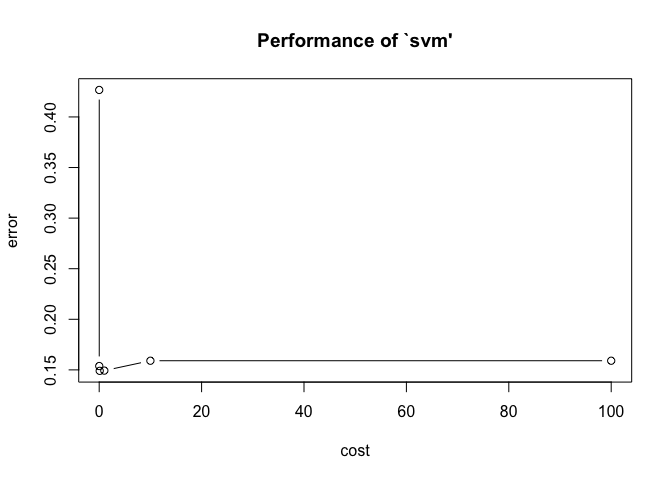
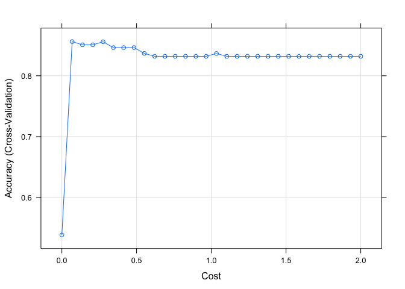

Demonstration of Simple Support Vector Classifier
================
JAS/jck2183-note
null

## Demonstration of Support Vector Classifiers

Data Citation: We are using a dataset containing features related to
heart disease. There are 13 features and the outcome variable is a
binary, classification variable indicating the presence of heart
disease.

-----

### Step 1: Load packages

e1071 contains the svm function. Caret contains the data partitioning
functions for creating of our training and testing datasets. Remember to
install the packages if this is your first time utilizing them.

``` r
library(e1071)
library (caret)
```

    ## Loading required package: lattice

    ## Loading required package: ggplot2

\#\#Step 2: Load data and perform minor cleaning, check and recode
missings etc. 1. How to load a flat text file 2. How to assign column
names when none are provided 3. How to check variable types across the
dataframe 4. How to recode missing indicators, change variable types and
explore variable distributions

``` r
heart.data = read.csv("./data/processed.cleveland.data", header=FALSE)

var.names<-c("age", "sex", "pain_type", "resting_sysbp", "chol", "fast_blsugar_gt120", "rest_ecg", "max_hr", "exerc_angina", "ST_depression", "ST_slope", "vessels_colorflu", "defect", "heart_disease_present")

colnames(heart.data)<-var.names
str(heart.data)
```

    ## 'data.frame':    303 obs. of  14 variables:
    ##  $ age                  : num  63 67 67 37 41 56 62 57 63 53 ...
    ##  $ sex                  : num  1 1 1 1 0 1 0 0 1 1 ...
    ##  $ pain_type            : num  1 4 4 3 2 2 4 4 4 4 ...
    ##  $ resting_sysbp        : num  145 160 120 130 130 120 140 120 130 140 ...
    ##  $ chol                 : num  233 286 229 250 204 236 268 354 254 203 ...
    ##  $ fast_blsugar_gt120   : num  1 0 0 0 0 0 0 0 0 1 ...
    ##  $ rest_ecg             : num  2 2 2 0 2 0 2 0 2 2 ...
    ##  $ max_hr               : num  150 108 129 187 172 178 160 163 147 155 ...
    ##  $ exerc_angina         : num  0 1 1 0 0 0 0 1 0 1 ...
    ##  $ ST_depression        : num  2.3 1.5 2.6 3.5 1.4 0.8 3.6 0.6 1.4 3.1 ...
    ##  $ ST_slope             : num  3 2 2 3 1 1 3 1 2 3 ...
    ##  $ vessels_colorflu     : chr  "0.0" "3.0" "2.0" "0.0" ...
    ##  $ defect               : chr  "6.0" "3.0" "7.0" "3.0" ...
    ##  $ heart_disease_present: int  0 2 1 0 0 0 3 0 2 1 ...

``` r
heart.data[heart.data=="?"]<-NA

heart.data$defect<-as.numeric(factor(heart.data$defect))
heart.data$vessels_colorflu<-as.numeric(factor(heart.data$vessels_colorflu))

heart.data$outcome<-ifelse(heart.data$heart_disease_present==0, 0,1)
heart.data$heart_disease_present<-NULL
heart.data$outcome<-factor(heart.data$outcome)
levels(heart.data$outcome)<-c("HD Not Present", "HD Present")
str(heart.data)
```

    ## 'data.frame':    303 obs. of  14 variables:
    ##  $ age               : num  63 67 67 37 41 56 62 57 63 53 ...
    ##  $ sex               : num  1 1 1 1 0 1 0 0 1 1 ...
    ##  $ pain_type         : num  1 4 4 3 2 2 4 4 4 4 ...
    ##  $ resting_sysbp     : num  145 160 120 130 130 120 140 120 130 140 ...
    ##  $ chol              : num  233 286 229 250 204 236 268 354 254 203 ...
    ##  $ fast_blsugar_gt120: num  1 0 0 0 0 0 0 0 0 1 ...
    ##  $ rest_ecg          : num  2 2 2 0 2 0 2 0 2 2 ...
    ##  $ max_hr            : num  150 108 129 187 172 178 160 163 147 155 ...
    ##  $ exerc_angina      : num  0 1 1 0 0 0 0 1 0 1 ...
    ##  $ ST_depression     : num  2.3 1.5 2.6 3.5 1.4 0.8 3.6 0.6 1.4 3.1 ...
    ##  $ ST_slope          : num  3 2 2 3 1 1 3 1 2 3 ...
    ##  $ vessels_colorflu  : num  1 4 3 1 1 1 3 1 2 1 ...
    ##  $ defect            : num  2 1 3 1 1 1 1 1 3 3 ...
    ##  $ outcome           : Factor w/ 2 levels "HD Not Present",..: 1 2 2 1 1 1 2 1 2 2 ...

``` r
summary(heart.data)
```

    ##       age             sex           pain_type     resting_sysbp  
    ##  Min.   :29.00   Min.   :0.0000   Min.   :1.000   Min.   : 94.0  
    ##  1st Qu.:48.00   1st Qu.:0.0000   1st Qu.:3.000   1st Qu.:120.0  
    ##  Median :56.00   Median :1.0000   Median :3.000   Median :130.0  
    ##  Mean   :54.44   Mean   :0.6799   Mean   :3.158   Mean   :131.7  
    ##  3rd Qu.:61.00   3rd Qu.:1.0000   3rd Qu.:4.000   3rd Qu.:140.0  
    ##  Max.   :77.00   Max.   :1.0000   Max.   :4.000   Max.   :200.0  
    ##                                                                  
    ##       chol       fast_blsugar_gt120    rest_ecg          max_hr     
    ##  Min.   :126.0   Min.   :0.0000     Min.   :0.0000   Min.   : 71.0  
    ##  1st Qu.:211.0   1st Qu.:0.0000     1st Qu.:0.0000   1st Qu.:133.5  
    ##  Median :241.0   Median :0.0000     Median :1.0000   Median :153.0  
    ##  Mean   :246.7   Mean   :0.1485     Mean   :0.9901   Mean   :149.6  
    ##  3rd Qu.:275.0   3rd Qu.:0.0000     3rd Qu.:2.0000   3rd Qu.:166.0  
    ##  Max.   :564.0   Max.   :1.0000     Max.   :2.0000   Max.   :202.0  
    ##                                                                     
    ##   exerc_angina    ST_depression     ST_slope     vessels_colorflu
    ##  Min.   :0.0000   Min.   :0.00   Min.   :1.000   Min.   :1.000   
    ##  1st Qu.:0.0000   1st Qu.:0.00   1st Qu.:1.000   1st Qu.:1.000   
    ##  Median :0.0000   Median :0.80   Median :2.000   Median :1.000   
    ##  Mean   :0.3267   Mean   :1.04   Mean   :1.601   Mean   :1.672   
    ##  3rd Qu.:1.0000   3rd Qu.:1.60   3rd Qu.:2.000   3rd Qu.:2.000   
    ##  Max.   :1.0000   Max.   :6.20   Max.   :3.000   Max.   :4.000   
    ##                                                  NA's   :4       
    ##      defect                outcome   
    ##  Min.   :1.000   HD Not Present:164  
    ##  1st Qu.:1.000   HD Present    :139  
    ##  Median :1.000                       
    ##  Mean   :1.837                       
    ##  3rd Qu.:3.000                       
    ##  Max.   :3.000                       
    ##  NA's   :2

``` r
#Remove the missings
heart.data.nomiss<-na.omit(heart.data)

#Set No Heart Disease as Reference Level
heart.data.nomiss$outcome<-relevel(heart.data.nomiss$outcome, ref="HD Not Present")
```

### Step 3: Partition data into training and testing

``` r
set.seed(100)
train.indices<-createDataPartition(y=heart.data.nomiss$outcome,p=0.7,list=FALSE)

training<-heart.data.nomiss[train.indices,]
testing<-heart.data.nomiss[-train.indices,]
```

### Step 4: Construct and tune the Support Vector Machine with a linear classifier (Support Vector Classifier)

SVM requires us to set the hyperparameter C or cost. The smaller the
value of C, the less misclassification the SVM will accept (i.e. data
that crosses the hyperplane). We also set the kernel as linear to fit a
support vector classifier. By using scale=TRUE, we ask the svm to
standardize the variables.

``` r
set.seed(100)
svm.heart<-svm(outcome ~ ., data=training, kernel="linear", cost=1, scale=TRUE)
print(svm.heart)
```

    ## 
    ## Call:
    ## svm(formula = outcome ~ ., data = training, kernel = "linear", cost = 1, 
    ##     scale = TRUE)
    ## 
    ## 
    ## Parameters:
    ##    SVM-Type:  C-classification 
    ##  SVM-Kernel:  linear 
    ##        cost:  1 
    ## 
    ## Number of Support Vectors:  74

``` r
svm.pred<-predict(svm.heart, newdata=training[,1:13])
table(svm.pred, training$outcome)
```

    ##                 
    ## svm.pred         HD Not Present HD Present
    ##   HD Not Present            101         18
    ##   HD Present                 11         78

``` r
confusionMatrix(svm.pred, training$outcome, positive="HD Present")
```

    ## Confusion Matrix and Statistics
    ## 
    ##                 Reference
    ## Prediction       HD Not Present HD Present
    ##   HD Not Present            101         18
    ##   HD Present                 11         78
    ##                                           
    ##                Accuracy : 0.8606          
    ##                  95% CI : (0.8059, 0.9046)
    ##     No Information Rate : 0.5385          
    ##     P-Value [Acc > NIR] : <2e-16          
    ##                                           
    ##                   Kappa : 0.718           
    ##                                           
    ##  Mcnemar's Test P-Value : 0.2652          
    ##                                           
    ##             Sensitivity : 0.8125          
    ##             Specificity : 0.9018          
    ##          Pos Pred Value : 0.8764          
    ##          Neg Pred Value : 0.8487          
    ##              Prevalence : 0.4615          
    ##          Detection Rate : 0.3750          
    ##    Detection Prevalence : 0.4279          
    ##       Balanced Accuracy : 0.8571          
    ##                                           
    ##        'Positive' Class : HD Present      
    ## 

``` r
#Reminder this is how accuracy is calculated
misClasificError <- mean(svm.pred != training$outcome, na.rm=T)
print(paste('Accuracy Model 1',1-misClasificError))
```

    ## [1] "Accuracy Model 1 0.860576923076923"

``` r
features<-training[,1:13]
outcome<-training$outcome

svm_tune <- tune(svm, train.x=features, train.y=outcome,  kernel="linear", range=list(cost=10^(-3:2)))

summary(svm_tune)
```

    ## 
    ## Parameter tuning of 'svm':
    ## 
    ## - sampling method: 10-fold cross validation 
    ## 
    ## - best parameters:
    ##  cost
    ##   0.1
    ## 
    ## - best performance: 0.1490476 
    ## 
    ## - Detailed performance results:
    ##    cost     error dispersion
    ## 1 1e-03 0.4266667 0.13997894
    ## 2 1e-02 0.1538095 0.09486833
    ## 3 1e-01 0.1490476 0.10418431
    ## 4 1e+00 0.1492857 0.10442496
    ## 5 1e+01 0.1590476 0.11547987
    ## 6 1e+02 0.1590476 0.11547987

``` r
plot(svm_tune)
```

<!-- -->

``` r
best.tune<-svm_tune$best.parameters

svm.heart.new<-svm(outcome ~ ., data=training, kernel="linear", cost=best.tune,  scale=TRUE)

svm.pred.new<-predict(svm.heart.new, newdata=training[,1:13])
table(svm.pred.new, training$outcome)
```

    ##                 
    ## svm.pred.new     HD Not Present HD Present
    ##   HD Not Present            102         18
    ##   HD Present                 10         78

``` r
confusionMatrix(svm.pred, training$outcome, positive="HD Present")
```

    ## Confusion Matrix and Statistics
    ## 
    ##                 Reference
    ## Prediction       HD Not Present HD Present
    ##   HD Not Present            101         18
    ##   HD Present                 11         78
    ##                                           
    ##                Accuracy : 0.8606          
    ##                  95% CI : (0.8059, 0.9046)
    ##     No Information Rate : 0.5385          
    ##     P-Value [Acc > NIR] : <2e-16          
    ##                                           
    ##                   Kappa : 0.718           
    ##                                           
    ##  Mcnemar's Test P-Value : 0.2652          
    ##                                           
    ##             Sensitivity : 0.8125          
    ##             Specificity : 0.9018          
    ##          Pos Pred Value : 0.8764          
    ##          Neg Pred Value : 0.8487          
    ##              Prevalence : 0.4615          
    ##          Detection Rate : 0.3750          
    ##    Detection Prevalence : 0.4279          
    ##       Balanced Accuracy : 0.8571          
    ##                                           
    ##        'Positive' Class : HD Present      
    ## 

### Alternate: Using Caret

``` r
train_control<-trainControl(method="cv", number=10)

svm.caret<-train(outcome ~ ., data=training, method="svmLinear", trControl=train_control, preProcess=c("center", "scale"))

svm.caret
```

    ## Support Vector Machines with Linear Kernel 
    ## 
    ## 208 samples
    ##  13 predictor
    ##   2 classes: 'HD Not Present', 'HD Present' 
    ## 
    ## Pre-processing: centered (13), scaled (13) 
    ## Resampling: Cross-Validated (10 fold) 
    ## Summary of sample sizes: 188, 187, 187, 187, 187, 187, ... 
    ## Resampling results:
    ## 
    ##   Accuracy   Kappa    
    ##   0.8409524  0.6766672
    ## 
    ## Tuning parameter 'C' was held constant at a value of 1

``` r
#Incorporate different values for cost

svm.caret.2<-train(outcome ~ ., data=training, method="svmLinear", trControl=train_control, preProcess=c("center", "scale"), tuneGrid=expand.grid(C=seq(0.00001,2, length=30)))

svm.caret.2
```

    ## Support Vector Machines with Linear Kernel 
    ## 
    ## 208 samples
    ##  13 predictor
    ##   2 classes: 'HD Not Present', 'HD Present' 
    ## 
    ## Pre-processing: centered (13), scaled (13) 
    ## Resampling: Cross-Validated (10 fold) 
    ## Summary of sample sizes: 188, 187, 188, 188, 186, 187, ... 
    ## Resampling results across tuning parameters:
    ## 
    ##   C           Accuracy   Kappa    
    ##   0.00001000  0.5386147  0.0000000
    ##   0.06897517  0.8560173  0.7074376
    ##   0.13794034  0.8507792  0.6974473
    ##   0.20690552  0.8507792  0.6974473
    ##   0.27587069  0.8557792  0.7070330
    ##   0.34483586  0.8462554  0.6880293
    ##   0.41380103  0.8462554  0.6880293
    ##   0.48276621  0.8462554  0.6880293
    ##   0.55173138  0.8367316  0.6691987
    ##   0.62069655  0.8319697  0.6597856
    ##   0.68966172  0.8319697  0.6597856
    ##   0.75862690  0.8319697  0.6597856
    ##   0.82759207  0.8319697  0.6597856
    ##   0.89655724  0.8319697  0.6597856
    ##   0.96552241  0.8319697  0.6597856
    ##   1.03448759  0.8365152  0.6691795
    ##   1.10345276  0.8319697  0.6597856
    ##   1.17241793  0.8319697  0.6597856
    ##   1.24138310  0.8319697  0.6597856
    ##   1.31034828  0.8319697  0.6597856
    ##   1.37931345  0.8319697  0.6597856
    ##   1.44827862  0.8319697  0.6597856
    ##   1.51724379  0.8319697  0.6597856
    ##   1.58620897  0.8319697  0.6597856
    ##   1.65517414  0.8319697  0.6597856
    ##   1.72413931  0.8319697  0.6597856
    ##   1.79310448  0.8319697  0.6597856
    ##   1.86206966  0.8319697  0.6597856
    ##   1.93103483  0.8319697  0.6597856
    ##   2.00000000  0.8319697  0.6597856
    ## 
    ## Accuracy was used to select the optimal model using the largest value.
    ## The final value used for the model was C = 0.06897517.

``` r
plot(svm.caret.2)
```

<!-- -->

``` r
svm.caret.2$finalModel
```

    ## Support Vector Machine object of class "ksvm" 
    ## 
    ## SV type: C-svc  (classification) 
    ##  parameter : cost C = 0.0689751724137931 
    ## 
    ## Linear (vanilla) kernel function. 
    ## 
    ## Number of Support Vectors : 87 
    ## 
    ## Objective Function Value : -5.2486 
    ## Training error : 0.134615

### Apply in Test Set

``` r
svm.pred.test<-predict(svm.caret.2, newdata=testing[,1:13])
table(svm.pred.test, testing$outcome)
```

    ##                 
    ## svm.pred.test    HD Not Present HD Present
    ##   HD Not Present             40          8
    ##   HD Present                  8         33

``` r
confusionMatrix(svm.pred.test, testing$outcome, positive="HD Present")
```

    ## Confusion Matrix and Statistics
    ## 
    ##                 Reference
    ## Prediction       HD Not Present HD Present
    ##   HD Not Present             40          8
    ##   HD Present                  8         33
    ##                                           
    ##                Accuracy : 0.8202          
    ##                  95% CI : (0.7245, 0.8936)
    ##     No Information Rate : 0.5393          
    ##     P-Value [Acc > NIR] : 2.567e-08       
    ##                                           
    ##                   Kappa : 0.6382          
    ##                                           
    ##  Mcnemar's Test P-Value : 1               
    ##                                           
    ##             Sensitivity : 0.8049          
    ##             Specificity : 0.8333          
    ##          Pos Pred Value : 0.8049          
    ##          Neg Pred Value : 0.8333          
    ##              Prevalence : 0.4607          
    ##          Detection Rate : 0.3708          
    ##    Detection Prevalence : 0.4607          
    ##       Balanced Accuracy : 0.8191          
    ##                                           
    ##        'Positive' Class : HD Present      
    ##
