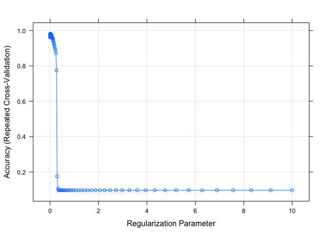

Demonstration of Caret for CaRT
================
JAS/jck2183-note
2021/2/16

## Overview of the Caret Package

The caret package (Classification And REgression Training) contains a
number of functions to streamline the process for creating analytic
pipelines for prediction. It calls to other libraries to run algorithms,
but provides a seamless and uniform interface for working with different
algorithms.

Primary functionalities of caret include:

  - pre-processing
  - data splitting
  - feature selection
  - model tuning using resampling
  - variable importance estimation

-----

Helpful resources using caret:

Max Kuhn’s explainer of the caret package
<https://topepo.github.io/caret/model-training-and-tuning.html>

Kuhn M. Building predictive models in R using the caret package. Journal
of Statistical Software 2008;28(5) doi: 10.18637/jss.v028.i05

Webinar, given by Max Kuhn, available on YouTube (\~1 hour):
<https://www.youtube.com/watch?v=7Jbb2ItbTC4>

### Some useful functions for pre-processing

``` r
library(tidyverse)
```

    ## ── Attaching packages ─────────────────────────────────────── tidyverse 1.3.0 ──

    ## ✓ ggplot2 3.3.3     ✓ purrr   0.3.4
    ## ✓ tibble  3.0.6     ✓ dplyr   1.0.4
    ## ✓ tidyr   1.1.2     ✓ stringr 1.4.0
    ## ✓ readr   1.4.0     ✓ forcats 0.5.1

    ## ── Conflicts ────────────────────────────────────────── tidyverse_conflicts() ──
    ## x dplyr::filter() masks stats::filter()
    ## x dplyr::lag()    masks stats::lag()

``` r
library(caret)
```

    ## Loading required package: lattice

    ## 
    ## Attaching package: 'caret'

    ## The following object is masked from 'package:purrr':
    ## 
    ##     lift

``` r
library(stats)

#Read in data on liver function study
set.seed(111)
hcvdat0 <- read.csv("./data/hcvdat0 .csv")
#Make outcome category a factor var
hcvdat0$Category<-as.factor(hcvdat0$Category)

#Collapse factor levels of outcome variable
hcvdat0$outcome.class<-fct_collapse(hcvdat0$Category, NED=c("0=Blood Donor","0s=suspect Blood Donor"), LiverDisease=c("1=Hepatitis", "2=Fibrosis", "3=Cirrhosis"))

#Drop category 
hcvdat0$Category<-NULL
hcvdat0$X<-NULL
hcvdat0<-na.omit(hcvdat0)

#Finding correlated predictors
hcvdat.numeric<- hcvdat0 %>% dplyr::select(where(is.numeric))
correlations<-cor(hcvdat.numeric, use="complete.obs")
high.correlations<-findCorrelation(correlations, cutoff=0.4)

#Remove highly correlated features
new.data.low.corr<-hcvdat.numeric[,-high.correlations]


#Centering and Scaling
set.up.preprocess<-preProcess(hcvdat.numeric, method=c("center", "scale"))
#Output pre-processed values
transformed.vals<-predict(set.up.preprocess, hcvdat.numeric)

#Creating balanced partitions in the data
train.index<-createDataPartition(hcvdat0$outcome.class, p=0.7, list=FALSE)

hcvdat.train<-hcvdat0[train.index,]
hcvdat.test<-hcvdat0[-train.index,]


#Construct k-folds in your data
train.folds<-createFolds(hcvdat0$outcome.class, k=10, list=FALSE)
```

### Model Training and Tuning

``` r
names(getModelInfo())
```

    ##   [1] "ada"                 "AdaBag"              "AdaBoost.M1"        
    ##   [4] "adaboost"            "amdai"               "ANFIS"              
    ##   [7] "avNNet"              "awnb"                "awtan"              
    ##  [10] "bag"                 "bagEarth"            "bagEarthGCV"        
    ##  [13] "bagFDA"              "bagFDAGCV"           "bam"                
    ##  [16] "bartMachine"         "bayesglm"            "binda"              
    ##  [19] "blackboost"          "blasso"              "blassoAveraged"     
    ##  [22] "bridge"              "brnn"                "BstLm"              
    ##  [25] "bstSm"               "bstTree"             "C5.0"               
    ##  [28] "C5.0Cost"            "C5.0Rules"           "C5.0Tree"           
    ##  [31] "cforest"             "chaid"               "CSimca"             
    ##  [34] "ctree"               "ctree2"              "cubist"             
    ##  [37] "dda"                 "deepboost"           "DENFIS"             
    ##  [40] "dnn"                 "dwdLinear"           "dwdPoly"            
    ##  [43] "dwdRadial"           "earth"               "elm"                
    ##  [46] "enet"                "evtree"              "extraTrees"         
    ##  [49] "fda"                 "FH.GBML"             "FIR.DM"             
    ##  [52] "foba"                "FRBCS.CHI"           "FRBCS.W"            
    ##  [55] "FS.HGD"              "gam"                 "gamboost"           
    ##  [58] "gamLoess"            "gamSpline"           "gaussprLinear"      
    ##  [61] "gaussprPoly"         "gaussprRadial"       "gbm_h2o"            
    ##  [64] "gbm"                 "gcvEarth"            "GFS.FR.MOGUL"       
    ##  [67] "GFS.LT.RS"           "GFS.THRIFT"          "glm.nb"             
    ##  [70] "glm"                 "glmboost"            "glmnet_h2o"         
    ##  [73] "glmnet"              "glmStepAIC"          "gpls"               
    ##  [76] "hda"                 "hdda"                "hdrda"              
    ##  [79] "HYFIS"               "icr"                 "J48"                
    ##  [82] "JRip"                "kernelpls"           "kknn"               
    ##  [85] "knn"                 "krlsPoly"            "krlsRadial"         
    ##  [88] "lars"                "lars2"               "lasso"              
    ##  [91] "lda"                 "lda2"                "leapBackward"       
    ##  [94] "leapForward"         "leapSeq"             "Linda"              
    ##  [97] "lm"                  "lmStepAIC"           "LMT"                
    ## [100] "loclda"              "logicBag"            "LogitBoost"         
    ## [103] "logreg"              "lssvmLinear"         "lssvmPoly"          
    ## [106] "lssvmRadial"         "lvq"                 "M5"                 
    ## [109] "M5Rules"             "manb"                "mda"                
    ## [112] "Mlda"                "mlp"                 "mlpKerasDecay"      
    ## [115] "mlpKerasDecayCost"   "mlpKerasDropout"     "mlpKerasDropoutCost"
    ## [118] "mlpML"               "mlpSGD"              "mlpWeightDecay"     
    ## [121] "mlpWeightDecayML"    "monmlp"              "msaenet"            
    ## [124] "multinom"            "mxnet"               "mxnetAdam"          
    ## [127] "naive_bayes"         "nb"                  "nbDiscrete"         
    ## [130] "nbSearch"            "neuralnet"           "nnet"               
    ## [133] "nnls"                "nodeHarvest"         "null"               
    ## [136] "OneR"                "ordinalNet"          "ordinalRF"          
    ## [139] "ORFlog"              "ORFpls"              "ORFridge"           
    ## [142] "ORFsvm"              "ownn"                "pam"                
    ## [145] "parRF"               "PART"                "partDSA"            
    ## [148] "pcaNNet"             "pcr"                 "pda"                
    ## [151] "pda2"                "penalized"           "PenalizedLDA"       
    ## [154] "plr"                 "pls"                 "plsRglm"            
    ## [157] "polr"                "ppr"                 "PRIM"               
    ## [160] "protoclass"          "qda"                 "QdaCov"             
    ## [163] "qrf"                 "qrnn"                "randomGLM"          
    ## [166] "ranger"              "rbf"                 "rbfDDA"             
    ## [169] "Rborist"             "rda"                 "regLogistic"        
    ## [172] "relaxo"              "rf"                  "rFerns"             
    ## [175] "RFlda"               "rfRules"             "ridge"              
    ## [178] "rlda"                "rlm"                 "rmda"               
    ## [181] "rocc"                "rotationForest"      "rotationForestCp"   
    ## [184] "rpart"               "rpart1SE"            "rpart2"             
    ## [187] "rpartCost"           "rpartScore"          "rqlasso"            
    ## [190] "rqnc"                "RRF"                 "RRFglobal"          
    ## [193] "rrlda"               "RSimca"              "rvmLinear"          
    ## [196] "rvmPoly"             "rvmRadial"           "SBC"                
    ## [199] "sda"                 "sdwd"                "simpls"             
    ## [202] "SLAVE"               "slda"                "smda"               
    ## [205] "snn"                 "sparseLDA"           "spikeslab"          
    ## [208] "spls"                "stepLDA"             "stepQDA"            
    ## [211] "superpc"             "svmBoundrangeString" "svmExpoString"      
    ## [214] "svmLinear"           "svmLinear2"          "svmLinear3"         
    ## [217] "svmLinearWeights"    "svmLinearWeights2"   "svmPoly"            
    ## [220] "svmRadial"           "svmRadialCost"       "svmRadialSigma"     
    ## [223] "svmRadialWeights"    "svmSpectrumString"   "tan"                
    ## [226] "tanSearch"           "treebag"             "vbmpRadial"         
    ## [229] "vglmAdjCat"          "vglmContRatio"       "vglmCumulative"     
    ## [232] "widekernelpls"       "WM"                  "wsrf"               
    ## [235] "xgbDART"             "xgbLinear"           "xgbTree"            
    ## [238] "xyf"

``` r
modelLookup("rpart")
```

    ##   model parameter                label forReg forClass probModel
    ## 1 rpart        cp Complexity Parameter   TRUE     TRUE      TRUE

``` r
modelLookup("adaboost")
```

    ##      model parameter  label forReg forClass probModel
    ## 1 adaboost     nIter #Trees  FALSE     TRUE      TRUE
    ## 2 adaboost    method Method  FALSE     TRUE      TRUE

``` r
## Cant use for regression but can use for classification.
#Train Function: used for tuning of hyperparameters and choosing "optimal" model

#Use trainControl Function to set method

#Perform `10-fold` cross-validation
control.settings<-trainControl(method="cv", number=10)

#Perform repeated 10-fold cross-validation
control.settings.b<-trainControl(method="repeatedcv", number=10, repeats=10)

#Perform sampling to balance data
control.settings.c<-trainControl(method="repeatedcv", number=10, repeats=10, sampling="down")

#Add into train function
set.seed(123)
lasso <- train(
 outcome.class ~., data = hcvdat.train, method = "glmnet",
  trControl = control.settings.c)

#Add tuning grid for lambda
lambda<-10^seq(-3,1, length=100)
lambda.grid<-expand.grid(alpha=1, lambda=lambda)

#Incorporate tuneGrid into train function
set.seed(123)
lasso.2 <- train(
 outcome.class ~., data = hcvdat.train, method = "glmnet",
  trControl = control.settings.c, tuneGrid = lambda.grid)


#Use plot to visualize tuning
plot(lasso.2)
```

<!-- -->

``` r
#summaryFunction will allow calculation of sensitivity and specificity, classProbs= TRUE will allow the calculation of predicted probabilities

control.settings.d<-trainControl(method="repeatedcv", number=10, repeats=5, sampling="down", classProbs = TRUE, summaryFunction = twoClassSummary)

#Incorporate tuneGrid into train function
set.seed(123)
lasso.2 <- train(
 outcome.class ~., data = hcvdat.train, method = "glmnet",
  trControl = control.settings.d, tuneGrid = lambda.grid, metric="ROC")
  
lasso.2$bestTune
```

    ##    alpha     lambda
    ## 33     1 0.01963041

``` r
#The tolerance function could be used to find a less complex model based on (x-xbest)/xbestx 100, which is #the percent difference. For example, to select parameter values based on a 2% loss of performance:

whichTwoPct <- tolerance(lasso.2$results, metric = "ROC", 
                         tol = 2, maximize = TRUE) ## smaller shrinkage based on lambda difference

lasso.2$results[whichTwoPct,1:6]
```

    ##   alpha      lambda       ROC      Sens  Spec      ROCSD
    ## 6     1 0.001592283 0.9543492 0.9716358 0.905 0.09435761

#### The tolerance function could be used to find a less complex model based on (x-xbest)/xbestx 100, which is \#the percent difference.

### Model Evaluation

``` r
test.outcome<-predict(lasso.2, hcvdat.test)

confusionMatrix(test.outcome, hcvdat.test$outcome, positive="LiverDisease")
```

    ## Confusion Matrix and Statistics
    ## 
    ##               Reference
    ## Prediction     NED LiverDisease
    ##   NED          156            4
    ##   LiverDisease   3           12
    ##                                           
    ##                Accuracy : 0.96            
    ##                  95% CI : (0.9193, 0.9838)
    ##     No Information Rate : 0.9086          
    ##     P-Value [Acc > NIR] : 0.007667        
    ##                                           
    ##                   Kappa : 0.7523          
    ##                                           
    ##  Mcnemar's Test P-Value : 1.000000        
    ##                                           
    ##             Sensitivity : 0.75000         
    ##             Specificity : 0.98113         
    ##          Pos Pred Value : 0.80000         
    ##          Neg Pred Value : 0.97500         
    ##              Prevalence : 0.09143         
    ##          Detection Rate : 0.06857         
    ##    Detection Prevalence : 0.08571         
    ##       Balanced Accuracy : 0.86557         
    ##                                           
    ##        'Positive' Class : LiverDisease    
    ##
