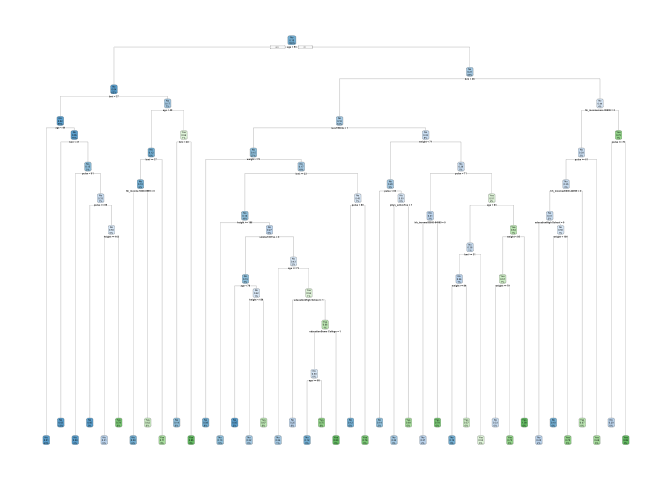
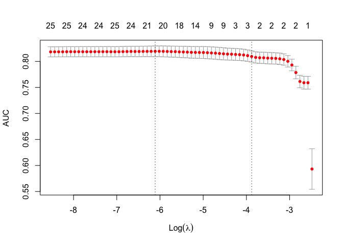

P8451-Assignment 6\_jck2183
================

## Import Data

### 1\. Restrict the NHANES data to the list of 11 variables below. Partition the data into training and testing using a 70/30 split.

``` r
data(NHANES) 
hw6_df = NHANES %>% select(Age, Race1, Education, HHIncome, Weight, Height, Pulse, Diabetes, BMI, PhysActive, Smoke100)
summary(hw6_df)
```

    ##       Age             Race1               Education           HHIncome   
    ##  Min.   : 0.00   Black   :1197   8th Grade     : 451   more 99999 :2220  
    ##  1st Qu.:17.00   Hispanic: 610   9 - 11th Grade: 888   75000-99999:1084  
    ##  Median :36.00   Mexican :1015   High School   :1517   25000-34999: 958  
    ##  Mean   :36.74   White   :6372   Some College  :2267   35000-44999: 863  
    ##  3rd Qu.:54.00   Other   : 806   College Grad  :2098   45000-54999: 784  
    ##  Max.   :80.00                   NA's          :2779   (Other)    :3280  
    ##                                                        NA's       : 811  
    ##      Weight           Height          Pulse        Diabetes         BMI       
    ##  Min.   :  2.80   Min.   : 83.6   Min.   : 40.00   No  :9098   Min.   :12.88  
    ##  1st Qu.: 56.10   1st Qu.:156.8   1st Qu.: 64.00   Yes : 760   1st Qu.:21.58  
    ##  Median : 72.70   Median :166.0   Median : 72.00   NA's: 142   Median :25.98  
    ##  Mean   : 70.98   Mean   :161.9   Mean   : 73.56               Mean   :26.66  
    ##  3rd Qu.: 88.90   3rd Qu.:174.5   3rd Qu.: 82.00               3rd Qu.:30.89  
    ##  Max.   :230.70   Max.   :200.4   Max.   :136.00               Max.   :81.25  
    ##  NA's   :78       NA's   :353     NA's   :1437                 NA's   :366    
    ##  PhysActive  Smoke100   
    ##  No  :3677   No  :4024  
    ##  Yes :4649   Yes :3211  
    ##  NA's:1674   NA's:2765  
    ##                         
    ##                         
    ##                         
    ## 

``` r
hw6_df = hw6_df %>%  
    janitor::clean_names() %>% 
    na.omit()
```

After excluding the missing values, we have total 6356 observations with
11 variables.

#### Partitioning

``` r
set.seed(100)
trRow = createDataPartition(hw6_df$diabetes, p=0.7, list=FALSE)

train_dat = hw6_df[trRow,]
```

    ## Warning: The `i` argument of ``[`()` can't be a matrix as of tibble 3.0.0.
    ## Convert to a vector.
    ## This warning is displayed once every 8 hours.
    ## Call `lifecycle::last_warnings()` to see where this warning was generated.

``` r
test_dat = hw6_df[-trRow,]

x.train = model.matrix(diabetes~., train_dat)[,-1]
x.test = model.matrix(diabetes~., test_dat)[,-1]

summary(x.train)
```

    ##       age        race1Hispanic      race1Mexican      race1White    
    ##  Min.   :20.00   Min.   :0.00000   Min.   :0.0000   Min.   :0.0000  
    ##  1st Qu.:33.00   1st Qu.:0.00000   1st Qu.:0.0000   1st Qu.:0.0000  
    ##  Median :46.00   Median :0.00000   Median :0.0000   Median :1.0000  
    ##  Mean   :47.04   Mean   :0.05483   Mean   :0.0791   Mean   :0.6897  
    ##  3rd Qu.:59.00   3rd Qu.:0.00000   3rd Qu.:0.0000   3rd Qu.:1.0000  
    ##  Max.   :80.00   Max.   :1.00000   Max.   :1.0000   Max.   :1.0000  
    ##    race1Other      education9 - 11th Grade educationHigh School
    ##  Min.   :0.00000   Min.   :0.000           Min.   :0.0000      
    ##  1st Qu.:0.00000   1st Qu.:0.000           1st Qu.:0.0000      
    ##  Median :0.00000   Median :0.000           Median :0.0000      
    ##  Mean   :0.07034   Mean   :0.116           Mean   :0.2121      
    ##  3rd Qu.:0.00000   3rd Qu.:0.000           3rd Qu.:0.0000      
    ##  Max.   :1.00000   Max.   :1.000           Max.   :1.0000      
    ##  educationSome College educationCollege Grad hh_income 5000-9999
    ##  Min.   :0.0000        Min.   :0.0000        Min.   :0.00000    
    ##  1st Qu.:0.0000        1st Qu.:0.0000        1st Qu.:0.00000    
    ##  Median :0.0000        Median :0.0000        Median :0.00000    
    ##  Mean   :0.3157        Mean   :0.3016        Mean   :0.02472    
    ##  3rd Qu.:1.0000        3rd Qu.:1.0000        3rd Qu.:0.00000    
    ##  Max.   :1.0000        Max.   :1.0000        Max.   :1.00000    
    ##  hh_income10000-14999 hh_income15000-19999 hh_income20000-24999
    ##  Min.   :0.00000      Min.   :0.00000      Min.   :0.00        
    ##  1st Qu.:0.00000      1st Qu.:0.00000      1st Qu.:0.00        
    ##  Median :0.00000      Median :0.00000      Median :0.00        
    ##  Mean   :0.05798      Mean   :0.05843      Mean   :0.06        
    ##  3rd Qu.:0.00000      3rd Qu.:0.00000      3rd Qu.:0.00        
    ##  Max.   :1.00000      Max.   :1.00000      Max.   :1.00        
    ##  hh_income25000-34999 hh_income35000-44999 hh_income45000-54999
    ##  Min.   :0.0000       Min.   :0.00000      Min.   :0.00000     
    ##  1st Qu.:0.0000       1st Qu.:0.00000      1st Qu.:0.00000     
    ##  Median :0.0000       Median :0.00000      Median :0.00000     
    ##  Mean   :0.1052       Mean   :0.09483      Mean   :0.08382     
    ##  3rd Qu.:0.0000       3rd Qu.:0.00000      3rd Qu.:0.00000     
    ##  Max.   :1.0000       Max.   :1.00000      Max.   :1.00000     
    ##  hh_income55000-64999 hh_income65000-74999 hh_income75000-99999
    ##  Min.   :0.00000      Min.   :0.00000      Min.   :0.0000      
    ##  1st Qu.:0.00000      1st Qu.:0.00000      1st Qu.:0.0000      
    ##  Median :0.00000      Median :0.00000      Median :0.0000      
    ##  Mean   :0.07191      Mean   :0.05753      Mean   :0.1238      
    ##  3rd Qu.:0.00000      3rd Qu.:0.00000      3rd Qu.:0.0000      
    ##  Max.   :1.00000      Max.   :1.00000      Max.   :1.0000      
    ##  hh_incomemore 99999     weight           height          pulse       
    ##  Min.   :0.0000      Min.   : 39.30   Min.   :139.9   Min.   : 40.00  
    ##  1st Qu.:0.0000      1st Qu.: 67.80   1st Qu.:162.1   1st Qu.: 64.00  
    ##  Median :0.0000      Median : 79.90   Median :169.4   Median : 72.00  
    ##  Mean   :0.2438      Mean   : 82.81   Mean   :169.2   Mean   : 72.44  
    ##  3rd Qu.:0.0000      3rd Qu.: 94.47   3rd Qu.:176.4   3rd Qu.: 80.00  
    ##  Max.   :1.0000      Max.   :230.70   Max.   :200.4   Max.   :128.00  
    ##       bmi        phys_activeYes    smoke100Yes    
    ##  Min.   :15.02   Min.   :0.0000   Min.   :0.0000  
    ##  1st Qu.:24.18   1st Qu.:0.0000   1st Qu.:0.0000  
    ##  Median :27.78   Median :1.0000   Median :0.0000  
    ##  Mean   :28.83   Mean   :0.5409   Mean   :0.4452  
    ##  3rd Qu.:32.20   3rd Qu.:1.0000   3rd Qu.:1.0000  
    ##  Max.   :81.25   Max.   :1.0000   Max.   :1.0000

### 2\. Construct three prediction models to predict diabetes using the 11 features from NHANES.

You will use the following three algorithms to create your prediction
models:

1)  Classification Tree

<!-- end list -->

``` r
set.seed(100)
train_ctrl = trainControl(method="cv", number=10)
tree_db1 = train(diabetes~ . , data=train_dat, method="rpart",trControl=train_ctrl)
tree_db1$bestTune
```

    ##            cp
    ## 2 0.008658009

``` r
rpart.plot(tree_db1$finalModel)
```

<!-- -->

``` r
pred_treedb1 = tree_db1 %>% predict(newx = x.test, type = 'prob')
tree_db1_prob = ifelse(pred_treedb1$Yes > 0.5,1,0)
test_treedb1 = (as.numeric(test_dat$diabetes)-1)
misClasificError_treedb1 = mean(tree_db1_prob != test_treedb1, na.rm = T)
```

    ## Warning in tree_db1_prob != test_treedb1: longer object length is not a multiple
    ## of shorter object length

``` r
print(paste('Accuracy Model Tree model 1',1-misClasificError_treedb1))
```

    ## [1] "Accuracy Model Tree model 1 0.883820224719101"

``` r
varImp(tree_db1)
```

    ## rpart variable importance
    ## 
    ##   only 20 most important variables shown (out of 34)
    ## 
    ##                           Overall
    ## age                       100.000
    ## bmi                        88.357
    ## weight                     58.870
    ## race1White                 22.478
    ## phys_activeYes             22.263
    ## pulse                      11.946
    ## hh_incomemore 99999        11.235
    ## height                     10.732
    ## race1Mexican                8.144
    ## hh_income20000-24999        6.610
    ## hh_income 5000-9999         5.562
    ## hh_income10000-14999        2.706
    ## educationHigh School        2.378
    ## smoke100Yes                 1.797
    ## hh_income65000-74999        1.700
    ## hh_income45000-54999        1.698
    ## educationCollege Grad       1.152
    ## `hh_income10000-14999`      0.000
    ## `hh_incomemore 99999`       0.000
    ## `education9 - 11th Grade`   0.000

Specify tuneGrid so caret explores wider variety of cp-values

``` r
grid = expand.grid(cp=seq(0.001,0.1, by=0.001))
tree_db2 = train(diabetes ~ ., data=train_dat, method="rpart", trControl=train_ctrl, tuneGrid=grid)
rpart.plot(tree_db2$finalModel)
```

<!-- -->

``` r
tree_db2$bestTune
```

    ##      cp
    ## 4 0.004

``` r
pred_treedb2 = tree_db2 %>% predict(newx = x.test, type = 'prob')
tree_db2_prob = ifelse(pred_treedb2$Yes > 0.5,1,0)
test_treedb2 = (as.numeric(test_dat$diabetes)-1)
misClasificError_treedb2 = mean(tree_db2_prob != test_treedb2, na.rm = T)
```

    ## Warning in tree_db2_prob != test_treedb2: longer object length is not a multiple
    ## of shorter object length

``` r
print(paste('Accuracy Model Tree model 2',1-misClasificError_treedb2))
```

    ## [1] "Accuracy Model Tree model 2 0.857528089887641"

``` r
varImp(tree_db2)
```

    ## rpart variable importance
    ## 
    ##   only 20 most important variables shown (out of 39)
    ## 
    ##                         Overall
    ## age                     100.000
    ## bmi                      79.830
    ## weight                   70.390
    ## height                   43.034
    ## pulse                    42.267
    ## phys_activeYes           25.790
    ## race1White               24.433
    ## hh_incomemore 99999      14.381
    ## race1Mexican             13.937
    ## hh_income 5000-9999       9.699
    ## smoke100Yes               9.313
    ## educationHigh School      9.308
    ## hh_income55000-64999      8.181
    ## educationSome College     7.088
    ## hh_income20000-24999      3.914
    ## education9 - 11th Grade   2.984
    ## educationCollege Grad     2.855
    ## hh_income35000-44999      2.439
    ## hh_income10000-14999      1.602
    ## hh_income65000-74999      1.007

``` r
set.seed(100)
grid = expand.grid(.cp=0.002)
tree_db3 = train(diabetes ~ ., data=train_dat, method="rpart", trControl=train_ctrl, tuneGrid=grid)
rpart.plot(tree_db3$finalModel)
```

<!-- -->

``` r
pred_treedb3 = tree_db3 %>% predict(newx = x.test, type = 'prob')
tree_db3_prob = ifelse(pred_treedb3$Yes > 0.5,1,0)
test_treedb3 = (as.numeric(test_dat$diabetes)-1)
misClasificError_treedb3 = mean(tree_db3_prob != test_treedb3, na.rm = T)
```

    ## Warning in tree_db3_prob != test_treedb3: longer object length is not a multiple
    ## of shorter object length

``` r
print(paste('Accuracy Model Tree model 3',1-misClasificError_treedb3))
```

    ## [1] "Accuracy Model Tree model 3 0.850112359550562"

``` r
varImp(tree_db3)
```

    ## rpart variable importance
    ## 
    ##   only 20 most important variables shown (out of 39)
    ## 
    ##                         Overall
    ## age                     100.000
    ## bmi                      86.816
    ## weight                   75.289
    ## pulse                    49.130
    ## height                   47.924
    ## phys_activeYes           26.322
    ## race1White               24.758
    ## race1Mexican             14.582
    ## hh_incomemore 99999      14.173
    ## smoke100Yes              10.759
    ## hh_income 5000-9999       9.558
    ## educationHigh School      9.375
    ## hh_income55000-64999      8.063
    ## educationSome College     6.986
    ## education9 - 11th Grade   4.232
    ## educationCollege Grad     3.986
    ## hh_income20000-24999      3.857
    ## hh_income15000-19999      3.455
    ## hh_income35000-44999      2.404
    ## hh_income10000-14999      1.579

2)  Support Vector Classifier (i.e. Support Vector Machine with a linear
    classifier)

<!-- end list -->

``` r
set.seed(100)
linear_tune = tune.svm(diabetes ~., data = train_dat, 
                        kernel = "linear",
                        range=list(cost=10^(-3:2)))

summary(linear_tune)
```

    ## 
    ## Error estimation of 'svm' using 10-fold cross validation: 0.1038202

``` r
best_linear = linear_tune$best.model
tune_test = predict(best_linear, newdata = test_dat)
table(tune_test, test_dat$diabetes)
```

    ##          
    ## tune_test   No  Yes
    ##       No  1709  197
    ##       Yes    0    0

``` r
confusionMatrix(tune_test, test_dat$diabetes, positive = "Yes")
```

    ## Confusion Matrix and Statistics
    ## 
    ##           Reference
    ## Prediction   No  Yes
    ##        No  1709  197
    ##        Yes    0    0
    ##                                         
    ##                Accuracy : 0.8966        
    ##                  95% CI : (0.8821, 0.91)
    ##     No Information Rate : 0.8966        
    ##     P-Value [Acc > NIR] : 0.519         
    ##                                         
    ##                   Kappa : 0             
    ##                                         
    ##  Mcnemar's Test P-Value : <2e-16        
    ##                                         
    ##             Sensitivity : 0.0000        
    ##             Specificity : 1.0000        
    ##          Pos Pred Value :    NaN        
    ##          Neg Pred Value : 0.8966        
    ##              Prevalence : 0.1034        
    ##          Detection Rate : 0.0000        
    ##    Detection Prevalence : 0.0000        
    ##       Balanced Accuracy : 0.5000        
    ##                                         
    ##        'Positive' Class : Yes           
    ## 

3)  Logistic regression.

<!-- end list -->

``` r
set.seed(100)
logit_mod = glm(diabetes ~ ., family=binomial(link ='logit'), data = train_dat) 
summary(logit_mod)
```

    ## 
    ## Call:
    ## glm(formula = diabetes ~ ., family = binomial(link = "logit"), 
    ##     data = train_dat)
    ## 
    ## Deviance Residuals: 
    ##     Min       1Q   Median       3Q      Max  
    ## -1.9204  -0.4607  -0.2791  -0.1566   3.2422  
    ## 
    ## Coefficients:
    ##                           Estimate Std. Error z value Pr(>|z|)    
    ## (Intercept)             -13.522930   3.913540  -3.455 0.000549 ***
    ## age                       0.069657   0.004156  16.763  < 2e-16 ***
    ## race1Hispanic            -0.374661   0.298852  -1.254 0.209964    
    ## race1Mexican              0.239863   0.247173   0.970 0.331834    
    ## race1White               -0.700768   0.165041  -4.246 2.18e-05 ***
    ## race1Other                0.314452   0.251140   1.252 0.210533    
    ## education9 - 11th Grade  -0.576037   0.239808  -2.402 0.016302 *  
    ## educationHigh School     -0.276874   0.218881  -1.265 0.205889    
    ## educationSome College    -0.240865   0.217732  -1.106 0.268620    
    ## educationCollege Grad    -0.268245   0.236749  -1.133 0.257201    
    ## hh_income 5000-9999       0.148165   0.482085   0.307 0.758583    
    ## hh_income10000-14999      0.068170   0.438531   0.155 0.876466    
    ## hh_income15000-19999     -0.091915   0.442880  -0.208 0.835590    
    ## hh_income20000-24999      0.193453   0.436207   0.443 0.657411    
    ## hh_income25000-34999     -0.341353   0.428809  -0.796 0.426004    
    ## hh_income35000-44999     -0.156380   0.426197  -0.367 0.713680    
    ## hh_income45000-54999     -0.370690   0.440782  -0.841 0.400358    
    ## hh_income55000-64999      0.084637   0.442085   0.191 0.848173    
    ## hh_income65000-74999     -0.490210   0.465281  -1.054 0.292076    
    ## hh_income75000-99999     -0.252180   0.433066  -0.582 0.560357    
    ## hh_incomemore 99999      -0.384052   0.423965  -0.906 0.365011    
    ## weight                   -0.012461   0.020455  -0.609 0.542395    
    ## height                    0.028163   0.022680   1.242 0.214340    
    ## pulse                     0.011838   0.004592   2.578 0.009934 ** 
    ## bmi                       0.130678   0.058353   2.239 0.025126 *  
    ## phys_activeYes           -0.153347   0.117329  -1.307 0.191219    
    ## smoke100Yes               0.227447   0.112100   2.029 0.042462 *  
    ## ---
    ## Signif. codes:  0 '***' 0.001 '**' 0.01 '*' 0.05 '.' 0.1 ' ' 1
    ## 
    ## (Dispersion parameter for binomial family taken to be 1)
    ## 
    ##     Null deviance: 2967.2  on 4449  degrees of freedom
    ## Residual deviance: 2353.9  on 4423  degrees of freedom
    ## AIC: 2407.9
    ## 
    ## Number of Fisher Scoring iterations: 6

``` r
fit_lm = predict(logit_mod, test_dat, type ="response")
lm_prob = ifelse(fit_lm > 0.5,1,0)
test_lm = (as.numeric(test_dat$diabetes)-1) 
misClasificError_lm = mean(lm_prob != test_lm, na.rm=T) 
print(paste('Accuracy Model Logistic Model',1-misClasificError_lm))
```

    ## [1] "Accuracy Model Logistic Model 0.892444910807975"

``` r
library(InformationValue)
```

    ## 
    ## Attaching package: 'InformationValue'

    ## The following objects are masked from 'package:caret':
    ## 
    ##     confusionMatrix, precision, sensitivity, specificity

``` r
set.seed(100)
logistic_fit = cv.glmnet(x.train, train_dat$diabetes, family = "binomial", type.measure = "auc", nfolds = 10)

plot(logistic_fit)
```

<!-- -->

``` r
logistic_fit$lambda.1se
```

    ## [1] 0.02067932

``` r
logistic_fit$lambda.min
```

    ## [1] 0.002217376

``` r
coef(logistic_fit, s = "lambda.1se")
```

    ## 27 x 1 sparse Matrix of class "dgCMatrix"
    ##                                   1
    ## (Intercept)             -6.12616892
    ## age                      0.04280580
    ## race1Hispanic            .         
    ## race1Mexican             .         
    ## race1White              -0.07562313
    ## race1Other               .         
    ## education9 - 11th Grade  .         
    ## educationHigh School     .         
    ## educationSome College    .         
    ## educationCollege Grad    .         
    ## hh_income 5000-9999      .         
    ## hh_income10000-14999     .         
    ## hh_income15000-19999     .         
    ## hh_income20000-24999     .         
    ## hh_income25000-34999     .         
    ## hh_income35000-44999     .         
    ## hh_income45000-54999     .         
    ## hh_income55000-64999     .         
    ## hh_income65000-74999     .         
    ## hh_income75000-99999     .         
    ## hh_incomemore 99999      .         
    ## weight                   .         
    ## height                   .         
    ## pulse                    .         
    ## bmi                      0.06053640
    ## phys_activeYes           .         
    ## smoke100Yes              .

``` r
pred_logistic = predict(logistic_fit, newx = x.test, 
                  s = "lambda.1se",
                  type = "response")
logistic_prob = ifelse(pred_logistic > 0.5, 1, 0)
test_lm = (as.numeric(test_dat$diabetes)-1) 
misClasificError_lm = mean(logistic_prob  != test_lm, na.rm=T)
print(paste('Accuracy Model Logistic Model',1-misClasificError_lm))
```

    ## [1] "Accuracy Model Logistic Model 0.896117523609654"

### 3.You will optimize each model using cross-validation to choose hyperparameters in the training data and then compare performance across models.

### 4\. Calculate final accuracy in a test set for the model you determine to be the most appropriate model.

### 5\. List and describe at least two limitations of the model generated by this analysis. Limitations can be analytical or they can be regarding how the model would be used in practice.
