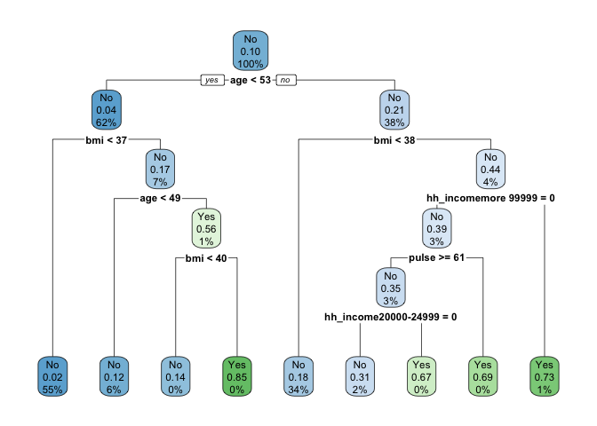
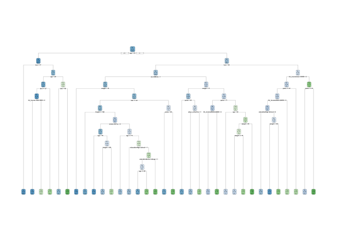
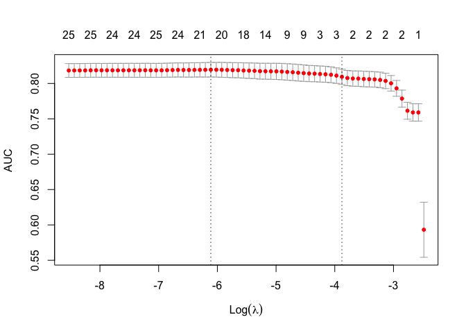

P8451-Assignment 6\_jck2183
================

## Import Data

### 1\. Restrict the NHANES data to the list of 11 variables below. Partition the data into training and testing using a 70/30 split.

``` r
data(NHANES) 
hw6_df = NHANES %>% select(Age, Race1, Education, HHIncome, Weight, Height, Pulse, Diabetes, BMI, PhysActive, Smoke100)
#summary(hw6_df)
```

``` r
hw6_df = hw6_df %>%  
    janitor::clean_names() %>% 
    na.omit()
```

After excluding the missing values, we have total 6356 observations with
11 variables.

#### Partitioning

``` r
set.seed(100)
trRow = createDataPartition(hw6_df$diabetes, p = 0.7, list = FALSE)

train_dat = hw6_df[trRow,]
```

    ## Warning: The `i` argument of ``[`()` can't be a matrix as of tibble 3.0.0.
    ## Convert to a vector.
    ## This warning is displayed once every 8 hours.
    ## Call `lifecycle::last_warnings()` to see where this warning was generated.

``` r
test_dat = hw6_df[-trRow,]

x.train = model.matrix(diabetes~., train_dat)[,-1]
x.test = model.matrix(diabetes~., test_dat)[,-1]
```

### 2\. Construct three prediction models to predict diabetes using the 11 features from NHANES.

### 3.You will optimize each model using cross-validation to choose hyperparameters in the training data and then compare performance across models.

You will use the following three algorithms to create your prediction
models:

1)  Classification Tree

<!-- end list -->

``` r
set.seed(100)
train_ctrl = trainControl(method = "cv", number = 10)
tree_db1 = train(diabetes~ . , data = train_dat, method = "rpart",trControl = train_ctrl)
tree_db1$bestTune
```

    ##            cp
    ## 2 0.008658009

``` r
rpart.plot(tree_db1$finalModel)
```

<!-- -->

``` r
pred_treedb1 = tree_db1 %>% predict(newx = x.test, type = 'prob')
tree_db1_prob = ifelse(pred_treedb1$Yes > 0.5,1,0)
test_treedb1 = (as.numeric(test_dat$diabetes) - 1)
misClasificError_treedb1 = mean(tree_db1_prob != test_treedb1, na.rm = T)
```

    ## Warning in tree_db1_prob != test_treedb1: longer object length is not a multiple
    ## of shorter object length

``` r
print(paste('Accuracy Model Tree model 1',1 - misClasificError_treedb1))
```

    ## [1] "Accuracy Model Tree model 1 0.883820224719101"

``` r
varImp(tree_db1)
```

    ## rpart variable importance
    ## 
    ##   only 20 most important variables shown (out of 34)
    ## 
    ##                           Overall
    ## age                       100.000
    ## bmi                        88.357
    ## weight                     58.870
    ## race1White                 22.478
    ## phys_activeYes             22.263
    ## pulse                      11.946
    ## hh_incomemore 99999        11.235
    ## height                     10.732
    ## race1Mexican                8.144
    ## hh_income20000-24999        6.610
    ## hh_income 5000-9999         5.562
    ## hh_income10000-14999        2.706
    ## educationHigh School        2.378
    ## smoke100Yes                 1.797
    ## hh_income65000-74999        1.700
    ## hh_income45000-54999        1.698
    ## educationCollege Grad       1.152
    ## `hh_income10000-14999`      0.000
    ## `hh_incomemore 99999`       0.000
    ## `education9 - 11th Grade`   0.000

Specify tuneGrid so caret explores wider variety of cp-values

``` r
grid = expand.grid(cp = seq(0.001,0.1, by = 0.001))
tree_db2 = train(diabetes ~ ., data = train_dat, method = "rpart", trControl = train_ctrl, tuneGrid = grid)
rpart.plot(tree_db2$finalModel)
```

<!-- -->

``` r
tree_db2$bestTune
```

    ##      cp
    ## 4 0.004

``` r
pred_treedb2 = tree_db2 %>% predict(newx = x.test, type = 'prob')
tree_db2_prob = ifelse(pred_treedb2$Yes > 0.5,1,0)
test_treedb2 = (as.numeric(test_dat$diabetes) - 1)
misClasificError_treedb2 = mean(tree_db2_prob != test_treedb2, na.rm = T)
```

    ## Warning in tree_db2_prob != test_treedb2: longer object length is not a multiple
    ## of shorter object length

``` r
print(paste('Accuracy Model Tree model 2',1 - misClasificError_treedb2))
```

    ## [1] "Accuracy Model Tree model 2 0.857528089887641"

``` r
varImp(tree_db2)
```

    ## rpart variable importance
    ## 
    ##   only 20 most important variables shown (out of 39)
    ## 
    ##                         Overall
    ## age                     100.000
    ## bmi                      79.830
    ## weight                   70.390
    ## height                   43.034
    ## pulse                    42.267
    ## phys_activeYes           25.790
    ## race1White               24.433
    ## hh_incomemore 99999      14.381
    ## race1Mexican             13.937
    ## hh_income 5000-9999       9.699
    ## smoke100Yes               9.313
    ## educationHigh School      9.308
    ## hh_income55000-64999      8.181
    ## educationSome College     7.088
    ## hh_income20000-24999      3.914
    ## education9 - 11th Grade   2.984
    ## educationCollege Grad     2.855
    ## hh_income35000-44999      2.439
    ## hh_income10000-14999      1.602
    ## hh_income65000-74999      1.007

2)  Support Vector Classifier (i.e. Support Vector Machine with a linear
    classifier)

<!-- end list -->

``` r
set.seed(100)
linear_tune = tune.svm(diabetes ~., data = train_dat, 
                        kernel = "linear",
                        range = list(cost = 10^(-3:2)))

#summary(linear_tune)
best_linear = linear_tune$best.model
tune_test = predict(best_linear, newdata = test_dat)
table(tune_test, test_dat$diabetes)
```

    ##          
    ## tune_test   No  Yes
    ##       No  1709  197
    ##       Yes    0    0

``` r
confusionMatrix(tune_test, test_dat$diabetes, positive = "Yes")
```

    ## Confusion Matrix and Statistics
    ## 
    ##           Reference
    ## Prediction   No  Yes
    ##        No  1709  197
    ##        Yes    0    0
    ##                                         
    ##                Accuracy : 0.8966        
    ##                  95% CI : (0.8821, 0.91)
    ##     No Information Rate : 0.8966        
    ##     P-Value [Acc > NIR] : 0.519         
    ##                                         
    ##                   Kappa : 0             
    ##                                         
    ##  Mcnemar's Test P-Value : <2e-16        
    ##                                         
    ##             Sensitivity : 0.0000        
    ##             Specificity : 1.0000        
    ##          Pos Pred Value :    NaN        
    ##          Neg Pred Value : 0.8966        
    ##              Prevalence : 0.1034        
    ##          Detection Rate : 0.0000        
    ##    Detection Prevalence : 0.0000        
    ##       Balanced Accuracy : 0.5000        
    ##                                         
    ##        'Positive' Class : Yes           
    ## 

3)  Logistic regression.

<!-- end list -->

``` r
set.seed(100)
logit_mod = glm(diabetes ~ ., family=binomial(link = 'logit'), data = train_dat) 
#summary(logit_mod)
```

``` r
fit_lm = predict(logit_mod, test_dat, type = "response")
lm_prob = ifelse(fit_lm > 0.5,1,0)
test_lm = (as.numeric(test_dat$diabetes) - 1) 
misClasificError_lm = mean(lm_prob != test_lm, na.rm = T) 
print(paste('Accuracy Model Logistic Model',1-misClasificError_lm))
```

    ## [1] "Accuracy Model Logistic Model 0.892444910807975"

``` r
set.seed(100)
logistic_fit = cv.glmnet(x.train, train_dat$diabetes, family = "binomial", type.measure = "auc", nfolds = 10)

plot(logistic_fit)
```

<!-- -->

``` r
logistic_fit$lambda.1se
```

    ## [1] 0.02067932

``` r
logistic_fit$lambda.min
```

    ## [1] 0.002217376

``` r
coef(logistic_fit, s = "lambda.1se")
```

    ## 27 x 1 sparse Matrix of class "dgCMatrix"
    ##                                   1
    ## (Intercept)             -6.12616892
    ## age                      0.04280580
    ## race1Hispanic            .         
    ## race1Mexican             .         
    ## race1White              -0.07562313
    ## race1Other               .         
    ## education9 - 11th Grade  .         
    ## educationHigh School     .         
    ## educationSome College    .         
    ## educationCollege Grad    .         
    ## hh_income 5000-9999      .         
    ## hh_income10000-14999     .         
    ## hh_income15000-19999     .         
    ## hh_income20000-24999     .         
    ## hh_income25000-34999     .         
    ## hh_income35000-44999     .         
    ## hh_income45000-54999     .         
    ## hh_income55000-64999     .         
    ## hh_income65000-74999     .         
    ## hh_income75000-99999     .         
    ## hh_incomemore 99999      .         
    ## weight                   .         
    ## height                   .         
    ## pulse                    .         
    ## bmi                      0.06053640
    ## phys_activeYes           .         
    ## smoke100Yes              .

``` r
pred_logistic = predict(logistic_fit, newx = x.test, 
                  s = "lambda.1se",
                  type = "response")
logistic_prob = ifelse(pred_logistic > 0.5, 1, 0)
test_lm = (as.numeric(test_dat$diabetes) - 1) 
misClasificError_lm = mean(logistic_prob  != test_lm, na.rm = T)
print(paste('Accuracy Model Logistic Model',1 - misClasificError_lm))
```

    ## [1] "Accuracy Model Logistic Model 0.896117523609654"

### 4\. Calculate final accuracy in a test set for the model you determine to be the most appropriate model.

From the above calculation, SVM has the highest accuracy compared to the
other two models, with logistic regression coming as next and
classification tree as last. I will choose SVM as the most appropriate
model based on the accuracy in a test set.

### 5\. List and describe at least two limitations of the model generated by this analysis. Limitations can be analytical or they can be regarding how the model would be used in practice.

One limitations in the practice is that, since the support vector
classifier works by putting data points, above and below the classifying
hyperplane there is no probabilistic explanation for the classification.

Another limitation is that SVM will underperform in a large-p-small-n
scenario.
